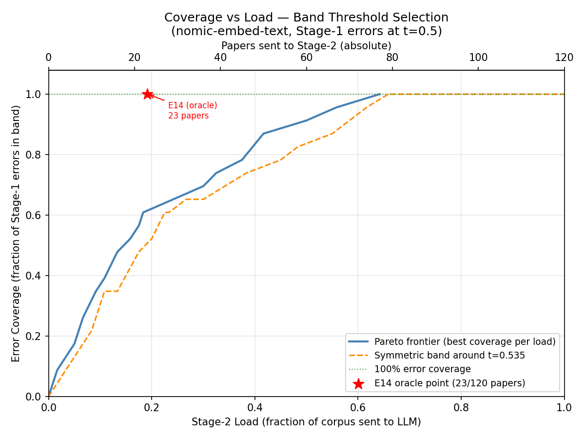

# Research Agent

An end-to-end system that takes a research topic, discovers relevant academic
papers via OpenAlex, summarizes them, and auto-generates a PowerPoint
presentation. Built on LlamaIndex event-driven workflows with Human-in-the-Loop
support and real-time streaming via Server-Sent Events.

> **Development hardware:** MacBook M1 (16 GB unified memory) — all local model
> inference and experiments in this repository run on this machine.

This repository is a fork of
[lz-chen/research-agent](https://github.com/lz-chen/research-agent),
last updated in May 2025. The original codebase had hard dependencies on
Azure OpenAI, Tavily Search, and Azure Container Instances — and was blocked
from further development by LlamaIndex 0.12 → 0.14 breaking API changes
across the entire workflow and agent layer, which I resolved as the
prerequisite for all subsequent work.

I took over the project in March 2026, removed all cloud-provider lock-in,
and ran systematic experiments to validate every key design decision with
quantitative benchmarks.

> Original author's articles:
> [How I Streamline My Research and Presentation with LlamaIndex Workflows](https://medium.com/data-science/how-i-streamline-my-research-and-presentation-with-llamaindex-workflows-3d75a9a10564) ·
> [Building an Interactive UI for Llamaindex Workflows](https://medium.com/data-science/building-an-interactive-ui-for-llamaindex-workflows-842dd7abedde)

---

## Contents

- [System Architecture](#system-architecture)
- [What I Changed From the Original](#what-i-changed-from-the-original)
- [PDF Parsing Tool Evaluation](#pdf-parsing-tool-evaluation)
- [Experiments](#experiments)
  - [Part 1 — Paper Discovery Pipeline](#part-1--paper-discovery-pipeline)
  - [Part 2 — Slide Generation Agent](#part-2--slide-generation-agent)
- [Setup](#setup)
- [Roadmap](#roadmap)

---

## System Architecture

**Before (original) → After (this fork):**

```
┌──────────────────────────────┬──────────────────────────────────────┐
│  Original (lz-chen)          │  This fork                           │
├──────────────────────────────┼──────────────────────────────────────┤
│  Azure OpenAI (hardcoded)    │  LiteLLM → any provider              │
│                              │  (Ollama / Gemini / Groq / Mistral / │
│                              │   OpenRouter — .env only)            │
├──────────────────────────────┼──────────────────────────────────────┤
│  Tavily Search               │  OpenAlex API (API key required,     │
│  + Semantic Scholar          │  ~$1/day; viable for side projects)  │
│    citation expansion        │                                      │
├──────────────────────────────┼──────────────────────────────────────┤
│  LLM scores all candidates   │  Two-stage filter: embedding         │
│  with FunctionCallingProgram │  pre-screen + LLM on ambiguous       │
│  (3-point scale, no          │  subset only (~42% of corpus)        │
│   pre-filtering)             │                                      │
├──────────────────────────────┼──────────────────────────────────────┤
│  Azure Container Instance    │  Docker via llm-sandbox (local)      │
│  (cloud sandbox)             │                                      │
├──────────────────────────────┼──────────────────────────────────────┤
│  Azure VLM                   │  LiteLLMMultiModal (custom class,    │
│                              │   any vision-capable provider)       │
└──────────────────────────────┴──────────────────────────────────────┘
```

**Current pipeline:**

```
User Input (research topic)
        │
        ▼
┌───────────────────────────────────────────────────┐
│  Paper Discovery                                  │
│                                                   │
│  OpenAlex Search → Quality Filters                │
│        │                                          │
│        ▼                                          │
│  Two-Stage Relevance Filter                       │
│  (embedding pre-screen + LLM verification)        │
│        │                                          │
│        ▼                                          │
│  PDF Download (4-strategy fallback chain)         │
│        │                                          │
│        ▼                                          │
│  PDF → Markdown  (planned: Docling)               │
└───────────────────────────────────────────────────┘
        │
        ▼
┌───────────────────────────────────────────────────┐
│  Summary & Slide Generation                       │
│                                                   │
│  Paper Summarization (LLM)                        │
│        │                                          │
│        ▼                                          │
│  Slide Outline + Layout Selection (LLM)           │
│        │                                          │
│  ┌─────▼──────────────────────────────────────┐   │
│  │  Human-in-the-Loop Review  (SSE ↔ FastAPI) │   │
│  └────────────────────────────────────────────┘   │
│        │                                          │
│        ▼                                          │
│  ReAct Agent → Docker Sandbox → python-pptx       │
└───────────────────────────────────────────────────┘
```

**Stack:** Python · FastAPI · LlamaIndex 0.14 · LiteLLM · Ollama ·
Docker (llm-sandbox) · MLflow · Streamlit

---

## What I Changed From the Original

### 1. Provider-agnostic LLM layer

Designed a `ModelFactory` class backed by LiteLLM. All LLM and embedding
instantiation is centralized — switching providers requires only `.env`
changes with zero code modification. Supports Ollama (local), Gemini, Groq,
Mistral, and OpenRouter out of the box.

Also implemented `LiteLLMMultiModal`, a custom class extending LlamaIndex's
`MultiModalLLM` interface, to bridge LiteLLM's provider-agnostic completion
API with LlamaIndex's multimodal workflow layer. Includes automatic fallback
to a secondary model on rate-limit errors (HTTP 429). `litellm.autolog()` and
`llama_index.autolog()` are integrated, automatically tracking cost, token
usage, and latency for every LLM call via MLflow.

### 2. Paper discovery pipeline

Replaced Tavily Search + Semantic Scholar with a two-stage pipeline using the
OpenAlex API (API key required, ~$1/day; sufficient for side-project scale).
Validated with a 120-paper manually-labelled benchmark — results in the
Experiments section. Removes Tavily dependency and produces fully deterministic
results.

### 3. Code execution sandbox

Replaced Azure Container Instances with a local Docker container pool via
`llm-sandbox`, wrapped in a `LlmSandboxToolSpec` class. Container pool
pre-warming eliminates cold-start overhead. Removes cloud execution cost
entirely.

---

## PDF Parsing Tool Evaluation

PDF parsing converts downloaded papers into text for summarization. I evaluated
three tools before selecting an approach.

### LlamaParse — Rejected

Evaluated on three ML papers across three service tiers
(`cost_effective` / `agentic` / `agentic_plus`).

**Rejection reasons:**
- **Cloud-only** — all parsing is sent to LlamaIndex servers; no local option
- **Credit consumption on tier switching** — switching tiers invalidates cloud
  cache, requiring a full re-parse at the higher tier's credit rate
  (4 credits/page for `cost_effective`, 15 credits/page for `agentic`)
- **Counter-intuitive quality regression** — `agentic_plus` converts all
  architecture diagrams to text; image nodes drop to zero. The most expensive
  tier produces the fewest preserved images
- **No server-side cache** — repeated requests with the same file ID show
  identical latency (~7–8s every time regardless of prior parses)
- **No spatial image coordinates** — images are returned by sequential index
  only; querying by page position is not supported

### marker-pdf — Rejected

marker uses surya as its underlying vision engine — surya provides OCR, layout
detection, table recognition, and LaTeX formula extraction. Quality on H100 GPU
is strong. However, it is not viable on Apple M1:

| Issue | Root cause | Impact |
|---|---|---|
| 12–18 min per paper | surya's OCR uses an autoregressive architecture; PyTorch MPS lacks FlashAttention support for this pattern; first-chunk cold start: 238s | Development iteration impossible |
| 20–25 min per test run | `paper2md()` calls `create_model_dict()` each invocation, reloading all surya models (~3 GB) and re-warming Metal shaders | Integration tests took hours |
| Memory pressure | Default GPU batch size requires ~25 GB; M1's 16 GB unified memory is shared between CPU and GPU | System swap thrashing |
| macOS Python 3.12 crash | Default `spawn` multiprocessing re-imports module-level code on subprocess start | Test runner crash on startup |

The root cause is PyTorch MPS maturity on Apple Silicon, not marker's output
quality. Not viable without a discrete GPU.

### Docling — Planned (next PoC)

Selected for evaluation because it is fully local, supports Apple's MLX
inference engine (MLX is Apple's own ML framework built natively for M-series
chips, bypassing PyTorch MPS entirely), and provides full image bounding-box
coordinates (`prov.bbox` with page coordinates), which is required for passing
specific figures to a vision model. Speed benchmark on H100: 3.70 s/page vs
marker's 2.84 s/page — note both numbers are from marker's own published
benchmark. M1 actual performance to be validated in the next PoC.

---

## Experiments

All experiments were run locally on an Apple MacBook M1 (16 GB unified memory).
LLM and embedding models were served locally via Ollama using Apple Metal.
Reported times reflect M1 execution and should not be treated as estimates for
GPU server or cloud deployments.

---

### Part 1 — Paper Discovery Pipeline

The four experiments below designed and validated each stage of the replacement
paper discovery pipeline:

```
Research Topic
      │
      ▼
 [Exp 1] Which OpenAlex search method?
 Can it fully replace Tavily?
      │  ~100 candidate papers
      ▼
 [Exp 2] How to filter relevant papers?
 Which architecture achieves best F1/speed?
      │  ~10–20 relevant papers
      ▼
 [Exp 3] What cosine score threshold routes
 papers to LLM verification in production?
      │
      ▼
 [Exp 4] Can open-access papers be
 reliably downloaded?
      │
      ▼
  Markdown text → Summary & Slide Generation
```

---

#### Experiment 1 — Search Method Comparison & Tavily Replacement

**Goal:** Determine whether Tavily can be fully replaced by OpenAlex and which
OpenAlex search method is most effective.

**Why the original design was structurally fragile:**

```
Path A — Original (Tavily):              Path B — Replacement (OpenAlex):

Tavily web search                        OpenAlex semantic search
      │                                        │
      │  ← 80% title match failure rate        │  quality filters
      ▼                                        │  (OA status / citations / year)
OpenAlex title lookup                          ▼
      │                                  Two-stage relevance filter
      │  ← seed quality determines all         │
      ▼                                        ▼
LLM relevance filter                     Relevant papers

2 fragile serial steps —                 Deterministic, single API call,
any failure breaks the pipeline          no external dependency
```

**Three OpenAlex search methods compared** (same topic, 25 results each):

| Search method | Relevant papers | Relevance rate | ArXiv availability |
|---|---|---|---|
| Keyword match (title + abstract) | 15 / 25 | 60% | 12% |
| BM25 full-text | 13 / 25 | 52% | 24% |
| Semantic (embedding-based) | **17 / 25** | **68%** | **36%** |

Semantic search returns a completely disjoint result set from keyword/BM25
(0% overlap) — the three methods are complementary rather than redundant.

**Head-to-head pipeline comparison across 5 research domains**
(NLP, Distributed Systems, RL, Computer Vision, Biomedical):

| | Path A: Tavily + citation expansion | Path B: OpenAlex direct |
|---|---|---|
| Domains reaching ≥ 10 relevant papers | 2 / 5 | 2 / 5 |
| Total relevant papers found | 53 | **64 (+20.8%)** |
| Domains returning zero candidates | **1 / 5** (flagship NLP topic fails) | **0 / 5** |
| Deterministic results | No | Yes |
| External paid API required | Yes (Tavily) | No |

**Decision:** Replace Tavily + Semantic Scholar with OpenAlex standalone. Path B
retrieves 20.8% more relevant papers, fails on zero domains, and removes all
paid API dependencies.

> → Full details: [experiments/01-openalex-paper-discovery/search_method_comparison.md](experiments/01-openalex-paper-discovery/search_method_comparison.md)

---

#### Experiment 2 — Paper Relevance Filter

**Goal:** Design a classifier that takes a paper's metadata (title, abstract,
keywords, topics) and decides whether it is relevant to the research topic.

**Dataset:** 120 papers manually labelled for *"attention mechanism in
transformer models"* — 60 relevant, 60 irrelevant.

**Four architectures compared:**

| Approach | Description | F1 | Precision | Recall | Time (s) |
|---|---|---|---|---|---|
| Keyword match | Title-level lexical match only | 0.847 | 0.862 | 0.833 | 0.0 |
| Standalone LLM | 2B model classifies each paper | 0.739 | 0.804 | 0.683 | 85.2 |
| Standalone embedding | Cosine similarity, paper vs topic | 0.861 | 0.766 | 0.983 | 127.8 |
| **Two-stage (selected)** | **Embedding pre-screen + LLM** | **0.974** | **1.000** | **0.950** | **26.0** |

The standalone LLM (F1 = 0.739) underperforms even the simple keyword baseline
(F1 = 0.847) — a 2B model does not reliably generalise relevance judgement
from zero-shot prompts alone.

**How the two-stage design achieves better accuracy at lower cost:**

```
All 120 papers
       │
       ▼
Stage 1: nomic-embed-text cosine similarity  (~22s for 120 papers)
       │
       ├── score > 0.610 ──────────────────→  ✅ Relevant
       │                                       (~58% of corpus, no LLM call)
       │
       ├── score 0.500–0.610 ──→  Stage 2: LLM strict prompt  (~4s)
       │   (ambiguous zone)              │
       │                                ├──→  ✅ Relevant
       │                                └──→  ❌ Rejected
       │                                       (~42% of corpus sent to LLM)
       │
       └── score < 0.500 ──────────────────→  ❌ Rejected
                                               (~0% of corpus, no LLM call)

Result: F1 = 0.974 · Precision = 1.000 · Recall = 0.950
        3.3× faster than standalone LLM · ~58% of papers skip the LLM entirely
```

**Three key findings from the ablation study:**

**Finding 1 — Chain-of-Thought prompting degrades small model performance**

| Prompt | F1 | Precision | Recall |
|---|---|---|---|
| Standard | 0.739 | 0.804 | 0.683 |
| Chain-of-Thought | 0.604 | 0.806 | 0.483 |

Adding CoT to a 2B model drops F1 by 13.5 points. Precision is unchanged;
recall collapses. Small models are harmed, not helped, by extended reasoning
chains.

**Finding 2 — Embedding model recall vs compute trade-off**

| Model | Parameters | F1 | Recall | Time (s) |
|---|---|---|---|---|
| nomic-embed-text | ~300M | 0.832 | 0.950 | 22.2 |
| qwen3-embedding:0.6b | 0.6B | 0.813 | 0.833 | 38.4 |
| qwen3-embedding:4b | 4B | 0.861 | 0.983 | 116.8 |

Scaling from 0.6B to 4B improves recall by 15 points but costs 3× more
compute. nomic-embed-text achieves the best recall-to-cost ratio and is
selected for Stage 1.

**Finding 3 — Stage-1 model choice matters more than Stage-2 prompt tuning**

Stage 2 (LLM) can remove wrong inclusions but cannot recover papers that Stage
1 never passed through. Choosing a Stage-1 embedding model with fewer misses is
therefore more impactful than optimising the Stage-2 prompt.
nomic-embed-text misses 3 papers vs 8 for qwen3-embedding:0.6b — this
difference directly determines the final recall ceiling (0.950 vs 0.917),
regardless of how well Stage 2 is tuned.

> → Full details: [experiments/01-openalex-paper-discovery/relevance_filter_ablation.md](experiments/01-openalex-paper-discovery/relevance_filter_ablation.md)

---

#### Experiment 3 — Threshold Analysis for Production Routing

**Goal:** The experiments use ground-truth labels to route papers to Stage 2.
In production, labels are unavailable — routing must rely solely on the
Stage-1 cosine similarity score. This experiment determines the score band
that should trigger Stage-2 LLM review.

ROC analysis on the 120-paper benchmark (AUC = 0.921):


The score distributions for relevant and irrelevant papers overlap in the range
[0.457, 0.607] — papers in this zone are ambiguous and benefit from LLM review:


**Production routing trade-off:**



| Band sent to Stage-2 LLM | Papers routed | % of corpus | Errors captured |
|---|---|---|---|
| Narrow [0.500, 0.610) | 50 | 41.7% | 87% |
| Wide [0.480, 0.610) | 60 | 50.0% | 91% |
| Full [0.455, 0.610) | 77 | 64.2% | 100% |

**Selected:** [0.500, 0.610) — captures all false positives while keeping
Stage-2 LLM load at 41.7% of corpus. The 3 papers missed in every band cannot
be recovered by Stage 2 regardless of band width, since Stage 1 missed them
entirely.

> → Full details: [experiments/01-openalex-paper-discovery/stage1_threshold_analysis.md](experiments/01-openalex-paper-discovery/stage1_threshold_analysis.md)

---

#### Experiment 4 — PDF Download Reliability

**Goal:** Validate that open-access papers found via OpenAlex can be reliably
downloaded, and identify the correct method for extracting ArXiv IDs.

**Non-obvious finding:** The ArXiv paper ID is absent from OpenAlex's
`work["ids"]` field — it must be parsed from
`work["locations"][*]["landing_page_url"]`. Handling this incorrectly causes
silent download failures with no error message.

A four-strategy fallback chain was designed and validated:

```
OpenAlex paper record
        │
        ▼  extract ArXiv ID from locations[].landing_page_url
   ┌────┴────────────────────────────────────────────────┐
   │  Strategy 1: ArXiv API  (arxiv.Client)              │
   │  ── if fail ──────────────────────────────────────  │
   │  Strategy 2: Constructed URL  arxiv.org/pdf/{id}    │
   │  ── if fail ──────────────────────────────────────  │
   │  Strategy 3: pyalex PDF endpoint                    │
   │  ── if fail ──────────────────────────────────────  │
   │  Strategy 4: OpenAlex OA URL                        │
   └─────────────────────────────────────────────────────┘
        │
        ▼
     PDF file
```

Filtering candidates to open-access status (`diamond`/`gold`/`green`) at the
search stage guarantees at least one fallback strategy will succeed for every
paper in the pool.

> → Full details: [experiments/01-openalex-paper-discovery/pdf_download_fallback.md](experiments/01-openalex-paper-discovery/pdf_download_fallback.md)

---

### Part 2 — Slide Generation Agent

The slide generation step uses a LlamaIndex ReAct Agent that writes and executes
python-pptx code inside a Docker sandbox container. During initial testing,
agents would output code as plain text instead of calling the tool — no file was
actually produced. The following experiments find the root cause and best
configuration.

---

#### Experiment 5 — Model Selection for ReAct Agent

**Goal:** Find the best local Ollama model for driving the slide generation
agent.

**Setup:** 3 rounds per model with identical prompts, tools, and task input as
the real pipeline.

| Model | Parameters | Slide generation | Tool calls | Slide modification |
|---|---|---|---|---|
| gemma3:4b | 4B | ✅ Success | **1 call** | ✅ Success |
| qwen3.5:4b | 4B | ✅ Success | 16 calls | ✅ Success |
| gemma3n:e2b | 2B | ❌ Timeout (600s) | 0 | — |
| gemma3n:e4b | 4B | ❌ Incompatible | 0 | — |

gemma3n:e4b outputs code in a Gemini-specific `tool_code` format instead of the
`Action: tool_name` format LlamaIndex ReAct expects — the framework terminates
with no execution.

**Root cause of the original failure:** The prompt phrasing *"Respond user with
the python code"* was ambiguous — models interpreted it as outputting code as
text rather than calling the tool. Changing to an explicit directive
(`CRITICAL: You MUST call run_code`) resolved gemma3:4b immediately. The issue
was prompt ambiguity, not model capability.

**Prompt style is task-dependent:** The `CRITICAL` directive that fixes slide
generation causes the slide modification task to fail completely (20-round loop,
zero tool calls). Each agent task requires independently designed prompts.

> → Full details: [experiments/02-agent-behavior/react_agent_behavior.md](experiments/02-agent-behavior/react_agent_behavior.md)

---

#### Experiment 6 — Slide Layout Selection

**Goal:** Measure whether LLMs can correctly choose the right PPTX layout
(e.g., `title_slide`, `bullet_list`, `academic_content`) given slide content,
and improve accuracy through prompt design.

**Baseline** — 3 models × 6 slide types × 3 runs = 54 inferences:

| Model | Parameters | Appropriate selections | Avg latency |
|---|---|---|---|
| gemma3:4b (local) | 4B | 6 / 18 **(33%)** | 8.8s |
| gpt-oss:20b (cloud) | 20B | 10 / 18 (56%) | 2.5s |
| ministral-3b (cloud) | 14B | 12 / 18 (67%) | 2.8s |

All three models universally fail on `title_slide` and `closing_slide` — a
systematic bias toward the most common layout regardless of content.

**Prompt engineering** — 4 strategies × 3 models × 6 slide types × 3 runs =
216 inferences:

| Prompt strategy | Description | gemma3:4b | ministral-3b | gpt-oss:20b |
|---|---|---|---|---|
| Decision-tree routing | Explicit if/else layout rules | 83% | 100% | 100% |
| **Negative examples (selected)** | **"Do NOT use X when Y"** | **100%** | **100%** | **100%** |
| Chain-of-Thought | Step-by-step reasoning | 67% | 100% | 100% |
| Minimal layout list | Shortest possible prompt | 67% | 100% | 89% |

The Negative Examples prompt is the only strategy reaching 100% across all
three models including the weakest local 4B model — from 33% to 100% for
gemma3:4b (+67 points). Consistent with the relevance filter finding: CoT
degrades performance on small models.

> → Full details: [experiments/02-agent-behavior/layout_selection_baseline.md](experiments/02-agent-behavior/layout_selection_baseline.md) · [layout_selection_prompt_eng.md](experiments/02-agent-behavior/layout_selection_prompt_eng.md)

---

#### Experiment 7 — Structured Output Method Comparison

**Goal:** Find a reliable method to extract structured JSON (matching a Pydantic
schema) from local Ollama models. A systematic comparison of 5 methods across
360 LLM calls (2 models × 4 prompts × 3 slide types × 3 runs) identified the
root cause of a production bug and reliable alternatives.

The 5 methods differ in where schema enforcement happens:

```
FunctionCallingProgram   → LLM provider API        ← fails for Ollama
LLMTextCompletionProgram → client-side parser       ← prompt-sensitive
Ollama format parameter  → Ollama server (grammar)  ← prompt-independent ✓
as_structured_llm()      → delegates to one above
structured_predict()     → delegates to one above
```

**Results:**

| Method | gemma3:4b | qwen3.5:4b |
|---|---|---|
| FunctionCallingProgram | **0% (all prompts)** | **0% (all prompts)** |
| LLMTextCompletionProgram | 0–100% | 100% |
| **Ollama format parameter** | **100% (all prompts)** | **100% (all prompts)** |
| as_structured_llm() | 0–100% | 100% |
| structured_predict() | 0–100% | 100% |

`FunctionCallingProgram` fails unconditionally for both models: Ollama returns
`{"properties": {...}}` — the schema definition itself, not populated values.
This is the confirmed root cause of the production bug.

The Ollama `format` parameter is the only method that achieves 100% regardless
of prompt quality. Because grammar enforcement happens at the token-sampling
level on the Ollama server, the model cannot produce invalid output even when
given a poorly-worded prompt — removing prompt sensitivity entirely.

> → Full details: [experiments/02-agent-behavior/structured_output_methods.md](experiments/02-agent-behavior/structured_output_methods.md)

---

## Setup

### Prerequisites

- Python >= 3.12
- Poetry
- Docker & Docker Compose
- Ollama (for local model inference)

### Installation

1. **Clone the repository:**
   ```bash
   git clone <repository-url>
   cd research-agent
   ```

2. **Configure environment variables:**
   ```bash
   cp .env.example .env
   # Edit .env — set your provider API keys and model names
   ```

3. **Build and start services:**
   ```bash
   docker-compose up --build
   ```

4. **Access the application:**
   - Frontend: `http://localhost:8501`
   - Backend API docs: `http://localhost:8000/docs`

---

## Roadmap

### Stage 1 — Provider-agnostic inference + OpenAlex pipeline *(in progress)*

All experiments above validate Stage 1 design decisions. Remaining:
- 🔧 Docling PDF parsing PoC (replacing marker-pdf)
- 🔧 Slide generation stability on small local models

### Stage 2 — Frontend migration to Vercel AI SDK

*Why:* Streamlit has fundamental limitations for streaming UX — no native SSE
chat interface, visible per-token rendering lag. Vercel AI SDK provides React
components built for LLM streaming.

### Stage 3 — RAG pipeline

*Why:* Current summarization uses full-context LLM calls per paper — expensive
in tokens and unable to recall across sessions. Planned: semantic chunking +
hybrid search (BM25 + vector) + RAGAS evaluation, with ablation across chunking
strategies, embedding models, and rerankers.

### Stage 4 — Multi-agent orchestration

*Why:* A single ReAct agent has limited reasoning depth for multi-paper
synthesis tasks. Planned: compare ReAct, Reflection, and Reflexion patterns
using LLM-as-judge evaluation.
