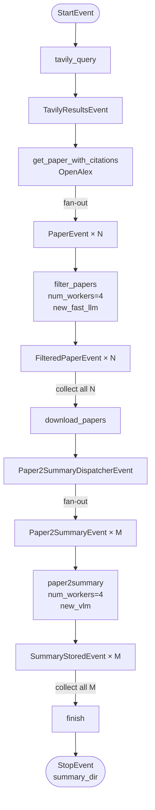
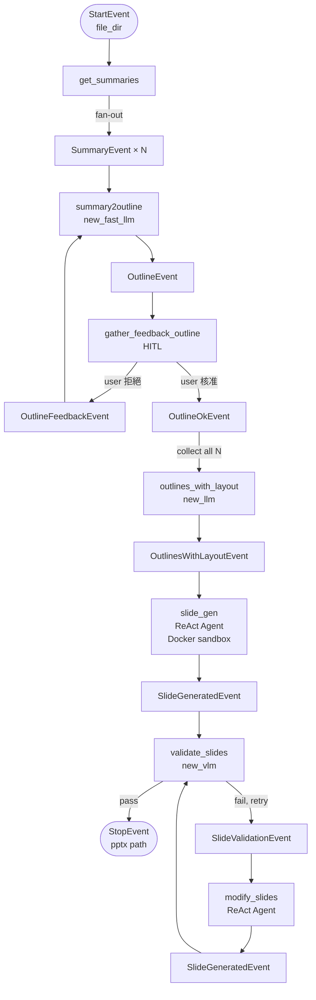

# Event System

本專案採用 **LlamaIndex Event-driven Workflow** 架構。每個 workflow step 透過發送/接收特定 Event 類型來串聯，實現非同步、可並行的處理管線。

## 核心概念

- **Event**：LlamaIndex `Event` 的子類，攜帶 step 間傳遞的資料
- **`@step`**：裝飾器，定義接受哪種 Event 作為輸入，回傳哪種 Event
- **`send_event()`**：主動發送 Event（用於 fan-out，即一個 step 產生多個事件）
- **`collect_events()`**：等待所有預期 Event 收齊後才繼續（用於 fan-in 合併）
- **`stream_events()`**：外部消費者（FastAPI 的 SSE）監聽 workflow 的實時進度

## 所有 Event 定義

> 定義於 `backend/agent_workflows/events.py`

### Paper Scraping 相關

| Event 類別 | 欄位 | 說明 |
|-----------|------|------|
| `TavilyResultsEvent` | `results: List[TavilySearchResult]` | Tavily 搜尋結果，包含論文標題與連結 |
| `PaperEvent` | `paper: Paper` | 單篇論文（fan-out，每篇發一個） |
| `FilteredPaperEvent` | `paper: Paper`, `is_relevant: IsCitationRelevant` | 過濾後的論文，含相關性評分 |
| `Paper2SummaryDispatcherEvent` | `papers_path: str` | 已下載 PDF 的目錄路徑 |
| `Paper2SummaryEvent` | `pdf_path: Path`, `image_output_dir: Path`, `summary_path: Path` | 單篇論文待摘要任務（fan-out） |
| `SummaryStoredEvent` | `fpath: Path` | 摘要已儲存完成，回傳 .md 路徑 |
| `SummaryWfReadyEvent` | `summary_dir: str` | SummaryGenerationWorkflow 完成，傳遞摘要目錄給 SlideGen |

### Slide Generation 相關

| Event 類別 | 欄位 | 說明 |
|-----------|------|------|
| `SummaryEvent` | `summary: str` | 單篇論文摘要內容（fan-out） |
| `OutlineEvent` | `summary: str`, `outline: SlideOutline` | 生成的投影片大綱 |
| `OutlineFeedbackEvent` | `summary: str`, `outline: SlideOutline`, `feedback: str` | User 拒絕後帶回 feedback，觸發重新生成 |
| `OutlineOkEvent` | `summary: str`, `outline: SlideOutline` | User 核准的大綱 |
| `OutlinesWithLayoutEvent` | `outlines_fpath: Path`, `outline_example: SlideOutlineWithLayout` | 所有大綱加上 layout 資訊後的結果 |
| `ConsolidatedOutlineEvent` | `outlines: List[SlideOutline]` | 合併後的大綱清單 |
| `PythonCodeEvent` | `code: str` | Agent 生成的 Python 代碼 |
| `SlideGeneratedEvent` | `pptx_fpath: str` | 生成的 PPTX 路徑（可能是初版或修改版） |
| `SlideValidationEvent` | `results: List[SlideNeedModifyResult]` | 驗證失敗的投影片清單，含修改建議 |

### 其他

| Event 類別 | 欄位 | 說明 |
|-----------|------|------|
| `DummyEvent` | `result: str` | Debug 用，替代 SummaryGenerationWorkflow 的 stub |
| `WorkflowStreamingEvent` | `event_type: str`, `event_sender: str`, `event_content: dict` | 包裝成 SSE 格式的進度訊息（定義於 `agent_workflows/schemas.py`） |

## Event 流向圖

### SummaryGenerationWorkflow



### SlideGenerationWorkflow



## Fan-out / Fan-in 並行模式

**Fan-out（`send_event`）：** 一個 step 主動產生多個 Event，同類的下游 step 並行處理

```python
# 範例：paper2summary_dispatcher 發出多個 Paper2SummaryEvent
for pdf_name in Path(ev.papers_path).glob("*.pdf"):
    ctx.data["n_pdfs"] += 1
    self.send_event(Paper2SummaryEvent(...))
```

**Fan-in（`collect_events`）：** 下游等到所有預期 Event 都到齊才執行

```python
# 範例：download_papers 等全部 FilteredPaperEvent
ready = ctx.collect_events(ev, [FilteredPaperEvent] * ctx.data["n_all_papers"])
if ready is None:
    return None  # 未齊，繼續等
```
