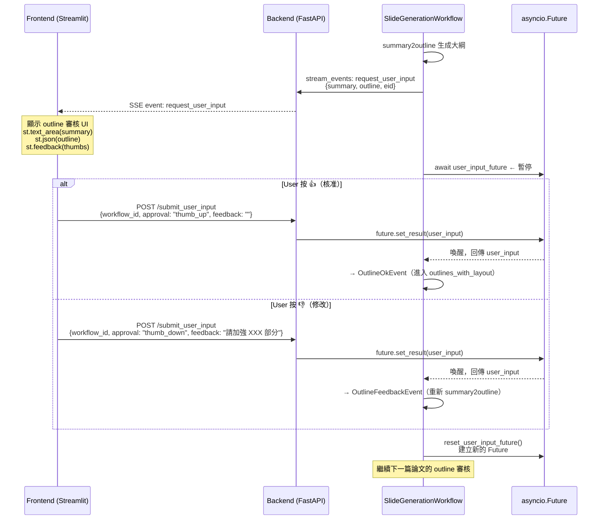

# Human-in-the-Loop (HITL)

HITL 機制讓 workflow 在生成每張投影片大綱後**暫停**，等待使用者審核後再繼續，確保最終簡報符合需求。

## 端對端流程



## 技術實作細節

### Future 機制

HITL 的關鍵是 `asyncio.Future`：

```python
# HumanInTheLoopWorkflow
self.user_input_future = asyncio.Future()

# gather_feedback_outline step（等待 user）
user_response = await self.user_input_future

# FastAPI /submit_user_input endpoint（由 user 觸發）
loop.call_soon_threadsafe(wf.user_input_future.set_result, user_input)
```

`call_soon_threadsafe` 是關鍵：FastAPI handler 在不同的 coroutine 中執行，需要 thread-safe 方式設定 Future。

### 多篇論文的並行 HITL

每篇論文的 outline 各自觸發一次 HITL。當同時有多個 `request_user_input` event 時，frontend 用 **Queue** 管理：

```python
# 若 user 正在審核中，新的 outline 加入 pending queue
if st.session_state.user_input_required:
    st.session_state.pending_user_inputs.append(content)
else:
    # 直接顯示
    st.session_state.user_input_required = True
    st.session_state.user_input_prompt = content
```

### Future Reset（多輪審核）

每次 user 提交回應後，workflow 必須重置 Future 以準備下一次等待：

```python
# 子 workflow 重置時，透過 parent_workflow 確保同步
if self.parent_workflow:
    await self.parent_workflow.reset_user_input_future()
    self.user_input_future = self.parent_workflow.user_input_future
else:
    self.user_input_future = self.loop.create_future()
```

`SummaryAndSlideGenerationWorkflow`（parent）的 `reset_user_input_future()` 建立新 Future 並讓子 workflow 指向同一個。

## User Input 格式

Frontend 送出的 JSON：

```json
{
  "workflow_id": "550e8400-...",
  "user_input": "{\"approval\": \":material/thumb_up:\", \"feedback\": \"\"}"
}
```

Workflow 解析邏輯：

```python
response_data = json.loads(user_response)
approval = response_data.get("approval", "").lower().strip()

if approval == ":material/thumb_up:":
    return OutlineOkEvent(...)
else:
    return OutlineFeedbackEvent(..., feedback=response_data["feedback"])
```

## 注意事項

- **Workflow timeout**：`SummaryAndSlideGenerationWorkflow` timeout 為 2000 秒，若 user 長時間未回應會超時
- **Future 生命週期**：每次 `submit_user_input` 後，舊 Future 廢棄，新 Future 建立，不能重複 `set_result`
- **Thread safety**：`user_input_future` 的 loop 必須與 workflow 的 event loop 一致，用 `call_soon_threadsafe` 跨 thread 設值
