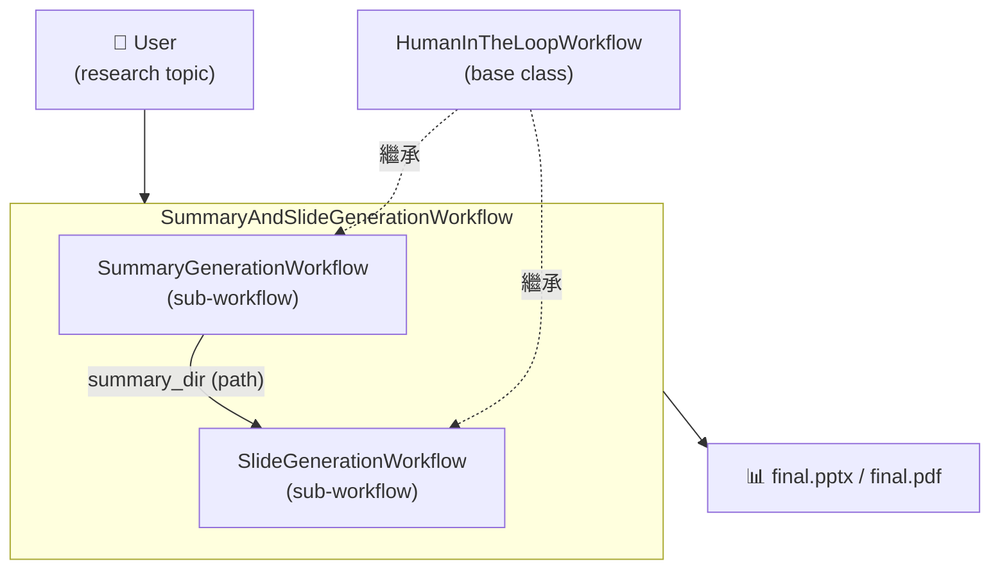
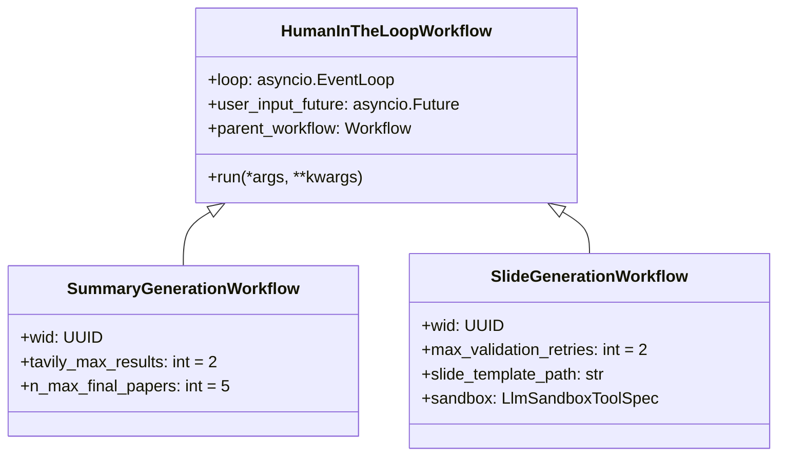
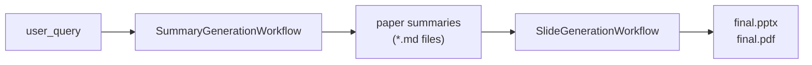

# Workflow Overview

本專案的核心邏輯由三個 **LlamaIndex Workflow** 構成，負責從使用者輸入的研究主題，全自動生成投影片。

## 三個 Workflow 的關係



| Workflow | 職責 | 繼承 |
|----------|------|------|
| `SummaryAndSlideGenerationWorkflow` | 編排兩個子 workflow，傳遞中間結果，共享 HITL user input future | `Workflow` |
| `SummaryGenerationWorkflow` | 論文搜尋（OpenAlex）、過濾、下載（ArXiv）、摘要（VLM） | `HumanInTheLoopWorkflow` |
| `SlideGenerationWorkflow` | outline 生成、HITL 審核、layout、ReAct Agent 生成投影片（Docker sandbox）、驗證修正 | `HumanInTheLoopWorkflow` |

---

## HumanInTheLoopWorkflow（基類）



`HumanInTheLoopWorkflow` 的主要職責：
- 封裝 **MLflow** 追蹤（`mlflow.llama_index.autolog()`）
- 儲存 `asyncio.EventLoop` 參考，供跨 thread HITL 用
- 持有 `user_input_future`，在等待 user 輸入時 `await` 此 Future

---

## 資料流總覽



中間產物（paper summaries）存放路徑：
```
workflow_artifacts/SummaryGenerationWorkflow/{wid}/data/papers_images/*.md
```

---

## 程式碼位置

```
backend/
└── agent_workflows/          # ← 注意：不是 workflows/（已改名以避免與 llama-index-workflows 衝突）
    ├── summarize_and_generate_slides.py  # SummaryAndSlideGenerationWorkflow（orchestrator，FastAPI 入口）
    ├── research_agent.py     # ResearchAgentWorkflow（備用 orchestrator）
    ├── summary_gen.py        # SummaryGenerationWorkflow
    ├── slide_gen.py          # SlideGenerationWorkflow
    ├── summary_using_images.py  # summarize_paper_images()（VLM 摘要）
    ├── summary_gen_w_qe.py   # SummaryGen with Query Engine（備用路徑）
    ├── paper_scraping.py     # OpenAlex 搜尋、ArXiv 下載、PDF→markdown
    ├── hitl_workflow.py      # HumanInTheLoopWorkflow 基類
    └── events.py             # 所有自訂 Event 類型
```

---

## 子 Workflow 事件轉發機制

`ResearchAgentWorkflow` 負責：

1. 將 `user_input_future` 注入子 workflow（確保 HITL 共享同一個 Future）
2. 設定 `parent_workflow` 反向引用（子 workflow 在 reset future 時用）
3. 轉發子 workflow 的所有 `stream_events()` 到上層 context

```python
async def run_subworkflow(self, sub_wf, ctx, **kwargs):
    sub_wf.user_input_future = self.user_input_future
    sub_wf.parent_workflow = self
    sub_task = asyncio.create_task(sub_wf.run(**kwargs))
    async for event in sub_wf.stream_events():
        ctx.write_event_to_stream(event)  # 轉發給 FastAPI SSE
    return await sub_task
```

---

## 相關文件

- [SummaryGenerationWorkflow 詳細流程](./summary-gen-workflow.md)
- [SlideGenerationWorkflow 詳細流程](./slide-gen-workflow.md)
- [Event 系統](./events.md)
- [Human-in-the-Loop 機制](./human-in-the-loop.md)
