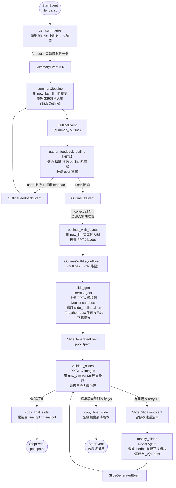

# SlideGenerationWorkflow

接收論文摘要目錄，透過 Human-in-the-Loop 審核、ReAct Agent 生成、多輪視覺驗證，最終產出 PPTX/PDF。

## 完整流程



## Step 詳細說明

### `get_summaries`

- 掃描 `file_dir/*.md`，記錄 `n_summaries` 數量
- 每篇 fan-out 發 `SummaryEvent`

### `summary2outline`

- 接受 `SummaryEvent` 或 `OutlineFeedbackEvent`（HITL 重試路徑）
- 用 `new_fast_llm(0.1)` + `FunctionCallingProgram` 輸出 `SlideOutline`：

```python
class SlideOutline(BaseModel):
    title: str
    content: List[str]   # 條列重點
    # ...
```

- 若是 feedback 路徑，使用 `MODIFY_SUMMARY2OUTLINE_PMT` prompt，帶入原大綱與 feedback

### `gather_feedback_outline`（HITL 核心）

詳細機制見 [`human-in-the-loop.md`](./human-in-the-loop.md)。簡述：
1. 透過 `ctx.write_event_to_stream()` 推送 `request_user_input` event
2. `await self.user_input_future` 暫停此 step
3. User 透過 frontend 送出後，`Future.set_result()` 喚醒
4. 解析 `approval` → `OutlineOkEvent` 或 `OutlineFeedbackEvent`

### `outlines_with_layout`

- fan-in 等所有 `OutlineOkEvent`
- 用 `new_llm(0.1)` 從可用 layout 列表中為每個大綱選擇最適合的 layout
- 輸出 `slide_outlines.json`（供 Agent 讀取）

Layout 資訊從 PPTX 模板抽取：`get_all_layouts_info(template_path)`

### `slide_gen`（ReAct Agent）

- 工具集：`LlmSandboxToolSpec`（`run_code`, `list_files`, `upload_file`）、`get_all_layout`
- LLM：`new_llm(0.1)`
- 流程：
  1. 上傳 PPTX 模板到 Docker sandbox（`/sandbox/` 目錄）
  2. Agent 讀取 `slide_outlines.json`
  3. 在 Docker container 執行 `python-pptx` 代碼生成投影片（`python-pptx` 預裝）
  4. 下載產出的 `.pptx` 到本地 workflow artifacts

> 使用 llama-index 0.14.x `ReActAgent` API：`agent.run(prompt)` + `stream_events()`

### `validate_slides`

- PPTX → 逐頁 PNG（`pptx2images`）
- 每頁用 `new_vlm()` + `MultiModalLLMCompletionProgram` 驗證

```python
class SlideValidationResult(BaseModel):
    is_valid: bool
    suggestion_to_fix: str
```

- 若全部 valid → `StopEvent`
- 若有問題 → `SlideValidationEvent`（含 `SlideNeedModifyResult` 清單）

### `modify_slides`（ReAct Agent）

- 與 `slide_gen` 使用相同工具集
- LLM：`new_llm(0.1)`
- 以 validation feedback 為 prompt，讓 Agent 修改現有 PPTX
- 修改後儲存為 `paper_summaries_v{n}.pptx`

## 產出物

```
workflow_artifacts/
└── SlideGenerationWorkflow/
    └── {wid}/
        ├── slide_outlines.json        # 大綱 JSON（含 layout 資訊）
        ├── code.py                    # Agent 生成的 Python 代碼
        ├── paper_summaries.pptx       # 初版投影片
        ├── paper_summaries_v1.pptx    # 第 1 次修改版（若有）
        ├── final.pptx                 # 最終版本（copy）
        └── final.pdf                  # PDF 版本（copy）
```

## 關鍵設定

| 參數 | 預設值 | 說明 |
|------|--------|------|
| `max_validation_retries` | `2` | 投影片驗證最大重試次數 |
| `slide_template_path` | `settings.SLIDE_TEMPLATE_PATH` | PPTX 模板路徑 |
| `generated_slide_fname` | `paper_summaries.pptx` | 初版輸出檔名 |

## CLI 執行（獨立運行，使用現有摘要）

```bash
cd backend
python -m agent_workflows.slide_gen --file_dir ./data/summaries_test
```
