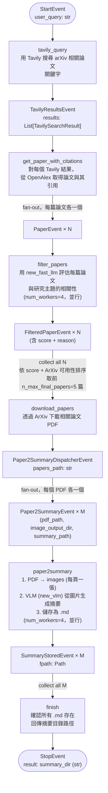

# SummaryGenerationWorkflow

負責從研究主題出發，自動搜尋、過濾、下載論文並生成 Markdown 摘要。

## 完整流程



## Step 詳細說明

### `tavily_query`

- 查詢語句格式：`"arxiv papers about the state of the art of {user_query}"`
- `tavily_max_results = 2`（預設）
- 輸出：`TavilyResultsEvent`，含標題與 URL

### `get_paper_with_citations`

- 對每個 Tavily 結果，呼叫 **OpenAlex**（`pyalex`）的 `search_papers()` + `get_citing_papers()`
- OpenAlex module-level config：`pyalex.config.email = settings.OPENALEX_EMAIL`（設一次，不重複）
- 自動去重（以 `entry_id` 為 key）
- 每篇論文 fan-out 發出一個 `PaperEvent`

```python
# agent_workflows/paper_scraping.py
paper = search_papers(query, limit=1)[0]
citations = get_citing_papers(paper, limit=50)
```

### `filter_papers`（並行 num_workers=4）

- 用 `new_fast_llm(temperature=0.0)` + `FunctionCallingProgram` 輸出結構化評分

```python
class IsCitationRelevant(BaseModel):
    score: int    # 相關性分數
    reason: str   # 判斷理由
```

### `download_papers`

- 等待所有 `FilteredPaperEvent`（fan-in）
- 依 `(score DESC, ArXiv 可用 DESC)` 排序，取前 5 篇
- 透過 `arxiv` Python 套件下載 PDF（最多重試 3 次）
- 無 ArXiv ID 的論文跳過

### `paper2summary_dispatcher`

- 掃描 `papers_path` 目錄下所有 `.pdf`
- 為每個 PDF 建立圖片輸出目錄與摘要路徑
- fan-out 發出 `Paper2SummaryEvent`

### `paper2summary`（並行 num_workers=4）

1. `pdf2images(pdf_path, image_output_dir)` — PDF 每頁轉 PNG
2. `summarize_paper_images(image_output_dir)` — 呼叫 `new_vlm().acomplete()` 逐頁分析並生成摘要
3. `save_summary_as_markdown(summary_txt, summary_path)` — 儲存 `.md`

### `finish`

- 等待所有 `SummaryStoredEvent`（fan-in）
- 斷言所有 `.md` 確實存在
- 回傳摘要目錄路徑（傳給 SlideGenerationWorkflow）

## 產出物

```
workflow_artifacts/
└── SummaryGenerationWorkflow/
    └── {wid}/
        └── data/
            ├── papers/
            │   ├── Paper Title A.pdf
            │   └── Paper Title B.pdf
            ├── papers_images/
            │   ├── Paper Title A/
            │   │   ├── page_1.png
            │   │   └── page_2.png
            │   └── ...
            └── papers_images/         # summary_path 指向 papers_images/
                ├── Paper Title A.md
                └── Paper Title B.md
```

## 設定參數

| 參數 | 預設值 | 說明 |
|------|--------|------|
| `tavily_max_results` | `2` | Tavily 回傳最多幾筆結果 |
| `n_max_final_papers` | `5` | 最多下載幾篇論文 |

## CLI 執行（獨立運行）

```bash
cd backend
python -m agent_workflows.summary_gen --user-query "powerpoint slides automation"
```
