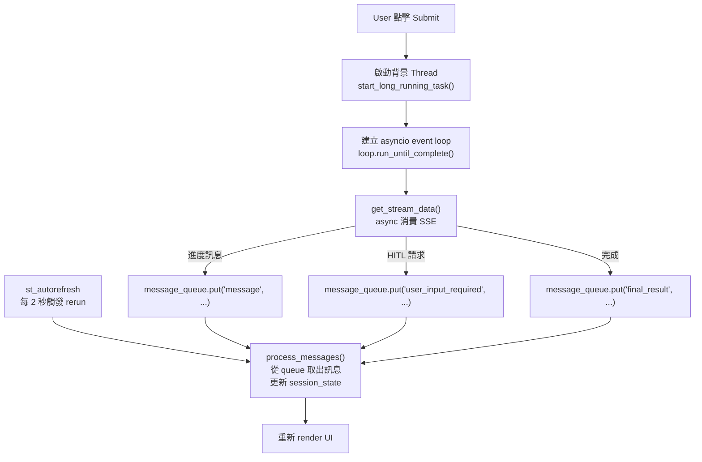
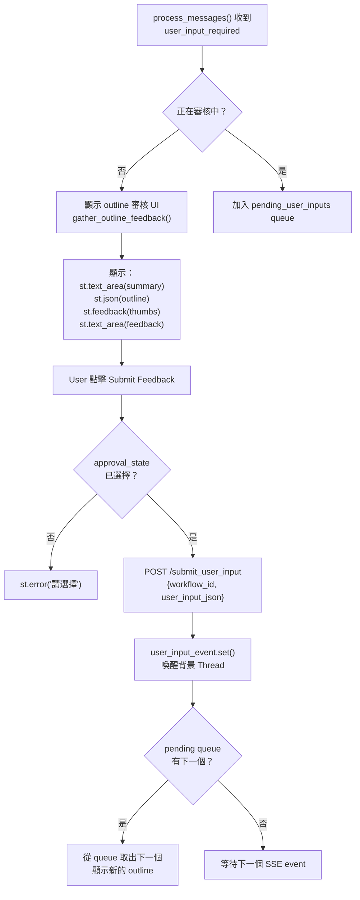

# Slide Generation Page

`pages/slide_generation_page.py` 是整個前端的核心頁面，處理 SSE 串流消費、HITL outline 審核、結果下載。

## 頁面佈局

```
┌──────────────────────────────────────────────────────┐
│ Sidebar                                              │
│  ┌────────────────────────────────┐                 │
│  │ Enter the topic of research:   │                 │
│  │ [text input]                   │                 │
│  │ [Submit]                       │                 │
│  └────────────────────────────────┘                 │
├────────────────────────┬─────────────────────────────┤
│ Left Column            │ Right Column                │
│ Workflow Executions    │ Workflow Artifacts          │
│                        │                             │
│ ▼ 🤖⚒️Agent is working │ [outline 審核 UI]           │
│   step message 1       │   或                        │
│   step message 2       │ [PDF 預覽 iframe]            │
│   ...                  │ [Download PPTX button]      │
└────────────────────────┴─────────────────────────────┘
```

## 背景執行架構

Streamlit 是同步框架，無法直接 `await` SSE 串流，因此採用 **背景 Thread + Queue** 解耦：



### 關鍵函式

| 函式 | 說明 |
|------|------|
| `fetch_streaming_data(url, payload)` | async generator，逐行 yield SSE 內容 |
| `get_stream_data(url, payload, queue, event)` | 消費 SSE，依 event type 放入 queue；遇到 `request_user_input` 時 `event.wait()` 阻塞，等 user 提交後繼續 |
| `start_long_running_task(...)` | Thread target，建立 event loop 執行 `get_stream_data` |
| `process_messages()` | 從 queue 取出所有訊息，更新 `session_state` |

## HITL Outline 審核流程



### Outline 審核 Widget

每次 outline 審核使用 `prompt_counter` 生成唯一 key 避免 Streamlit widget reuse 問題：

```python
approval_key = f"approval_state_{current_prompt}"
feedback_key = f"user_feedback_{current_prompt}"

approval = st.feedback("thumbs", key=approval_key)
feedback = st.text_area("Feedback:", key=feedback_key)
```

User input payload：

```json
{
  "approval": ":material/thumb_up:",   // 或 ":material/thumb_down:"
  "feedback": "請強調 XXX 方法的貢獻"
}
```

## 結果展示

Workflow 完成後，右側 column 展示：

1. **PDF 預覽**：透過 `base64` 將 PDF 嵌入 `<iframe>`
2. **PPTX 下載**：`st.download_button`，直接從 backend 抓取二進位內容

```python
# PDF 預覽
st.markdown(
    f'<iframe src="data:application/pdf;base64,{base64.b64encode(pdf_data).decode()}"
      width="100%" height="600px"></iframe>',
    unsafe_allow_html=True,
)

# PPTX 下載
st.download_button(
    label="Download Generated PPTX",
    data=pptx_data,
    file_name="generated_slides.pptx",
    mime="application/vnd.openxmlformats-officedocument.presentationml.presentation",
)
```

## Auto-refresh 機制

Streamlit 預設只在 user 互動時 rerun。為了顯示 SSE 進度，使用 `streamlit-autorefresh`：

```python
if not st.session_state.workflow_complete:
    st_autorefresh(interval=2000, limit=None, key="data_refresh")
```

- 每 **2 秒** 觸發一次 rerun
- `workflow_complete = True` 後停止（避免不必要的 rerun）
- 每次 rerun 都執行 `process_messages()` 取得最新進度

## 並發保護

防止重複啟動 Thread：

```python
if (
    st.session_state.workflow_thread is None
    or not st.session_state.workflow_thread.is_alive()
):
    # 啟動新 thread
```

防止重複提交 user response：

```python
if not st.session_state.user_response_submitted:
    # 執行提交邏輯
    st.session_state.user_response_submitted = True
```
