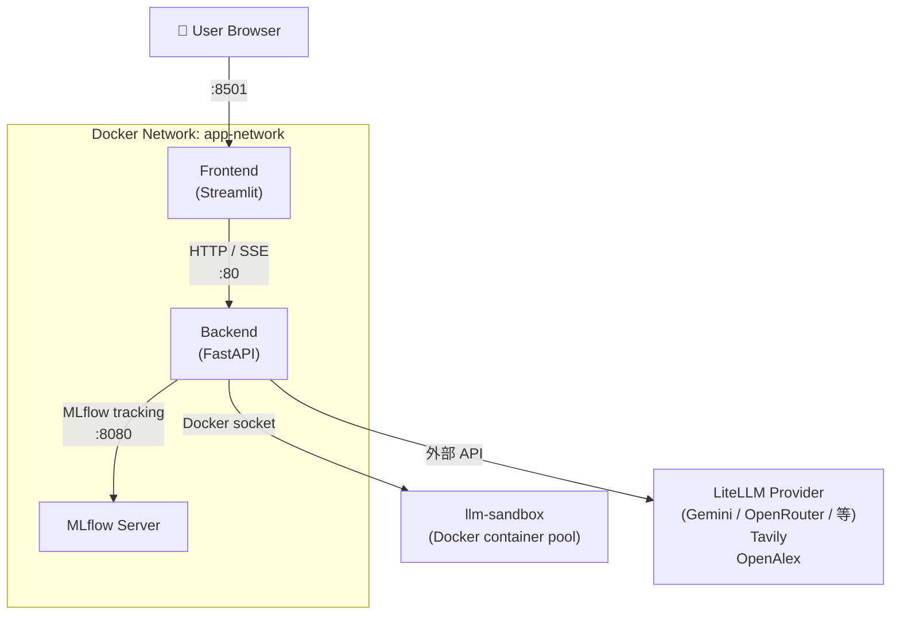

# Deployment

本專案透過 **Docker Compose** 管理所有服務，無需手動設定 Python 環境。

## 服務架構



## docker-compose 服務清單

### `backend`

| 項目 | 值 |
|------|-----|
| Build context | `./backend` |
| Host port | `8000` → container `80` |
| Network | `app-network` |

**Volumes：**

| Host 路徑 | Container 路徑 | 用途 |
|-----------|---------------|------|
| `.env` | `/app/.env` | 環境變數 |
| `./data` | `/app/data` | 論文 PDF、摘要存放 |
| `./workflow_artifacts` | `/app/workflow_artifacts` | 生成的 PPTX/PDF |
| `/var/run/docker.sock` | `/var/run/docker.sock` | llm-sandbox Docker socket（slide generation 需要） |
| `./mlruns` | `/app/mlruns` | MLflow run 紀錄 |
| `./mlartifacts` | `/app/mlartifacts` | MLflow artifacts |

> **Note:** `/var/run/docker.sock` 掛載讓 backend container 可以控制 Docker daemon，供 `LlmSandboxToolSpec` 建立和管理 Python sandbox container。

### `frontend`

| 項目 | 值 |
|------|-----|
| Build context | `./frontend` |
| Host port | `8501` → container `8501` |
| Network | `app-network` |

### `mlflow`

| 項目 | 值 |
|------|-----|
| Image | `ghcr.io/mlflow/mlflow:v2.16.0` |
| Host ports | `5000`, `8080` |
| Backend store | SQLite (`./mlruns/mlruns.db`) |
| Start command | `mlflow server --host 0.0.0.0 --port 8080` |

## 常用指令

```bash
# 初次啟動（build image + 啟動）
docker-compose up --build

# 背景執行
docker-compose up -d --build

# 查看 logs
docker-compose logs -f backend
docker-compose logs -f frontend

# 停止所有服務
docker-compose down

# 重新 build 特定服務
docker-compose build backend
docker-compose up -d --no-deps backend
```

## 資料目錄說明

系統運行後，以下目錄會自動產生：

```
.
├── data/
│   └── <workflow_id>/
│       ├── papers/              # 下載的論文 PDF
│       ├── papers_images/       # PDF 轉圖片（給 VLM 視覺分析用）
│       └── paper_summaries/     # Markdown 格式摘要
│
└── workflow_artifacts/
    └── SlideGenerationWorkflow/
        └── <workflow_id>/
            ├── slide_outlines.json   # 投影片大綱 JSON
            ├── paper_summaries.pptx  # 生成的投影片
            ├── final.pptx            # 最終版本
            └── final.pdf             # PDF 版本
```

## Port 衝突處理

若預設 port 已被佔用，修改 `docker-compose.yml` 中的 `ports` 設定：

```yaml
# 改為其他 port，格式：HOST:CONTAINER
ports:
  - "8001:80"   # backend
  - "8502:8501" # frontend
  - "8081:8080" # mlflow
```

## 本機開發（不使用 Docker Compose）

```bash
cd backend
poetry install
poetry run uvicorn main:app --reload --port 8000
```

> 本機執行時，Docker Desktop 仍需在背景執行，供 `LlmSandboxToolSpec` 使用。
