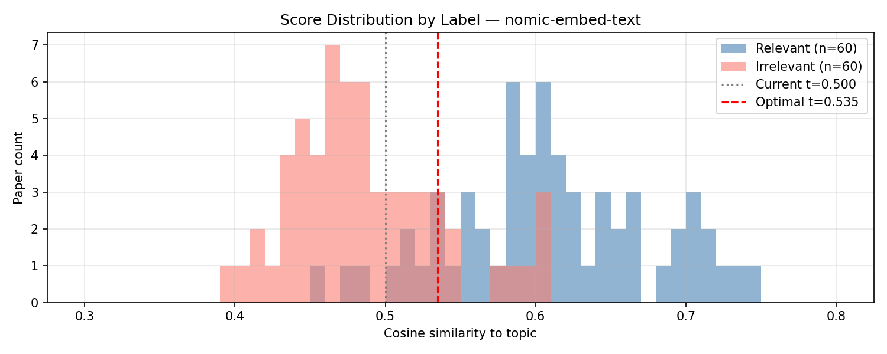

# Experiment 3 — Score-Band Routing: Calibrating the Two-Stage LLM Escalation Threshold

## Task Context

This experiment targets Step 2 — Re-ranking & Verification (README → System Architecture).

```
Input: ~100 candidate papers              ← Step 1: Paper Retrieval
      │
      ▼
┌── 2. RE-RANKING & VERIFICATION ──────────────────────────────────────────┐
├── Original (lz-chen) ────────────────┬── My Implementation ──────────────┤
│ GPT-4o (cloud)                       │ ① nomic-embed-text cosine sim     │
│ scores every candidate               │    (local, all papers)            │
│ single-stage, no pre-filter          │ ② qwen3.5:2b Strict survey prompt │
│                                      │    (local, ambiguous band only)   │
└──────────────────────────────────────┴───────────────────────────────────┘
      │
      ▼
Filtered papers (relevant only)           → Step 3: PDF Acquisition & Parsing
```

Exp 2 (ablation study) established that the two-stage hybrid architecture using `nomic-embed-text` Stage-1 and Prompt-Strict Stage-2 achieves F1=0.974. The ablation's Stage-2 routing relied on ground-truth labels to identify which papers Stage-1 misclassified — valid for evaluation but not deployable without a labeled dataset. This experiment determines how to replicate that routing using only the cosine similarity score.

> lz-chen's single-stage LLM filter uses a hardcoded threshold (score > 0) with no routing logic.** The score-band calibration problem is specific to the two-stage architecture introduced in Exp 2 — it does not exist in lz-chen's design.

```
Step 2 — Re-ranking & Verification (detail)
──────────────────────────────────────────────────────────────────
 Candidate papers (~100)
       │
       ▼
 Stage 1 — nomic-embed-text cosine similarity
   Output: similarity score s(i) per paper
       │
       ▼
 ┌─── EXPERIMENT TARGET ─────────────────────────────────────────────┐
 │ Score-band routing: which papers escalate to Stage-2?             │
 │   s(i) < lo        → confident negative, skip Stage-2             │
 │   lo ≤ s(i) < hi   → uncertain; escalate to Stage-2 LLM          │
 │   s(i) ≥ hi        → confident positive, skip Stage-2             │
 └───────────────────────────────────────────────────────────────────┘
       │
       ▼
 Stage 2 — LLM verification (Prompt-Strict, ambiguous papers only)
       │
       ▼
 Relevant papers   → Step 3: PDF Acquisition & Parsing
```

**Variable definitions used throughout this report:**

| Term | Meaning |
|---|---|
| Oracle routing | Routes paper to Stage-2 if and only if Stage-1 misclassified it — requires ground-truth labels; used in the Exp 2 ablation but not deployable |
| Score-band routing | Routes paper to Stage-2 if its cosine similarity score falls in [lo, hi) — requires no labels |
| lo / hi | Lower and upper bounds of the routing band |

---

## Summary

- **Problem:** The two-stage ablation (Exp 2) validated relevance filtering using oracle routing — sending a paper to Stage-2 only if the ground-truth label revealed Stage-1 got it wrong — a criterion that cannot run at inference time, when no label exists.
- **Solution:** A score-distribution analysis of `nomic-embed-text`'s similarity scores was used to derive a label-free score-band routing criterion.
- **Result:** The standard band [0.500, 0.610) is selected — it captures all 20 Stage-1 false positives while sending 41.7% of the corpus to Stage-2, matching oracle routing's final F1=0.974 and Precision=1.000.

---

## Experiment Setup

✅ = currently used in the pipeline.

**Analyses:**

| Analysis | Purpose |
|---|---|
| **Score distribution ✅** | **Identify overlap zone; characterize FP and FN score ranges relative to the threshold** |

**Metrics:**

| Metric | Definition | Role |
|---|---|---|
| **Cosine similarity score** | Similarity between a paper's text and the topic, output by Stage-1 | The only signal available to route papers without ground-truth labels |

Pass condition: band must capture all 20 Stage-1 false positives without requiring ground-truth labels.

**Execution parameters:**
- Embedding model: `nomic-embed-text` (via Ollama), matches the winning Stage-1 configuration from Exp 2
- Input fields: Basic — title + abstract + keywords + topics (same as `_build_paper_embedding_text()`)
- Topic: "attention mechanism in transformer models"
- Dataset: `groundtruth-balanced.json` — 120 papers (60 relevant / 60 irrelevant), manually verified
- Threshold sweep: 0.000 to 1.000, step 0.005 (201 operating points)
- Band sweep: lo and hi each in [0.30, 0.75], step 0.005; scores disk-cached to avoid re-embedding on repeated runs

---

## Full Experimental Results

### Score Distribution: Overlap Zone Characterization

- **Purpose:** Visualize where `nomic-embed-text` is uncertain and confirm that no single threshold can cleanly separate the two classes; characterize the FP and FN score ranges.
- **Expected:** The two distributions overlap in a band around the classification threshold, justifying two-stage routing.



| Group | Min | Max | Mean | Median |
|---|---|---|---|---|
| Relevant | 0.457 | 0.749 | 0.610 | 0.605 |
| Irrelevant | 0.392 | 0.607 | 0.487 | 0.479 |
| Overlap zone | 0.457 | 0.607 | — | — |

**Conclusion:** All Stage-1 errors fall in the overlap zone, but the two error types split cleanly on opposite sides of t=0.500 — FP above, FN below.

---

## Decision
¡
### What Is the Pipeline Score Band?

The band is [0.500, 0.610) — lo is the existing Stage-1 classification threshold, and hi is the highest score among irrelevant papers (0.607) plus a small buffer.

- This sends 50 of 120 papers (41.7%) to Stage-2 on the validation set — the fraction will vary by topic, since the score distribution shifts with topic specificity.

---

## Pipeline Integration Status ✅ INTEGRATED

Score-band routing replaced oracle routing in `PaperRelevanceFilter` (`paper_scraping.py` → `assess_relevance()`). The band uses only the cosine similarity score already computed by Stage-1, adding no additional inference cost.
