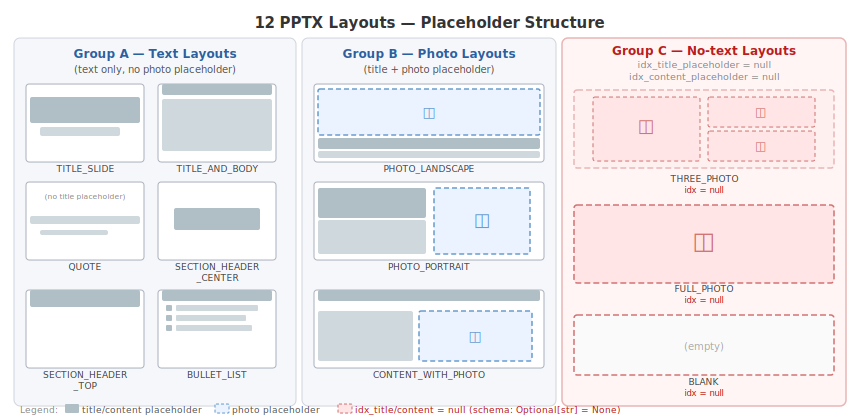

# Experiment 6 — Slide Layout Selection: Prompt Engineering for Accurate Layout Assignment

## Task Context

This experiment targets **Step 5 — Slide Outline + Human-in-the-Loop** from the system architecture (README → System Architecture). It builds on Experiment 5 (`structured_output_method_comparison.md`), which established `LLMTextCompletionProgram` as the reliable structured output method. This experiment focuses on *what prompt* achieves accurate layout selection within `outlines_with_layout`.

```
Input: paper summaries (*.md, one per paper)        ← Step 4: Summarization
      │
      ▼
┌── 5. SLIDE OUTLINE + HUMAN-IN-THE-LOOP ───────────────────────────────┐
├─── Original (lz-chen) ───────────┬─── My Implementation ─────────────┤
│ GPT-4o: 1 outline per paper      │ Local LLM: 1 title slide           │
│ FunctionCallingProgram           │           + 4 content slides       │
│ HITL: approve / reject           │ LLMTextCompletionProgram           │
│                                  │ HITL: approve / give feedback      │
│                                  │ → Layout selection by LLM          │
└──────────────────────────────────┴────────────────────────────────────┘
      │
      ▼
Output: slide_outlines.json                          → Step 6: PPTX Rendering
```

Within Step 5, the layout selection sub-step (`outlines_with_layout`) is the experiment target:

```
Step 5 — Slide Outline + Human-in-the-Loop (detail)
──────────────────────────────────────────────────────────────────
 paper summaries (*.md, one per paper)
       │
       ▼
 [summary2outline]        LLM → PaperSlideOutline
       │                  { paper_title, paper_authors, paper_year,
       │                    content_slides[4]: List[SlideOutline] }
       ▼                    ↑ loops back on rejection
 [gather_feedback_outline]    Human-in-the-Loop: approve / revise
       │
       ▼
 ┌─── EXPERIMENT TARGET ──────────────────────────────────────────┐
 │ [outlines_with_layout]                                         │
 │   For each content slide:                                      │
 │     LLM selects one of 12 layouts from PPTX template          │
 │   Input:  SlideOutline { title, content }                      │
 │   Prompt: AUGMENT_LAYOUT_PMT                                   │
 │   Output: SlideOutlineWithLayout { title, content,             │
 │                                    layout_name,                │
 │                                    idx_title_placeholder,      │
 │                                    idx_content_placeholder }   │
 └────────────────────────────────────────────────────────────────┘
       │
       ▼
 slide_outlines.json      → Step 6: PPTX Rendering
```

A **PPTX layout** is a slide template that defines which placeholder areas exist on a slide and where they are positioned — title bar, body text region, photo region, or nothing at all. The template (`assets/template.pptx`) used in this project contains 12 layouts grouped into 3 types by the placeholder fields they expose. The diagram below shows all 12 grouped by placeholder structure.



> 📌 **This experiment uses `assets/template.pptx`, a custom template I designed — the original author's codebase does not include a template file.** The 12 layouts, their names, groupings, and placeholder indices (idx=0/1/2) are specific to this template. A different PPTX template may have a different number of layouts, different layout names, and different placeholder idx assignments — `get_placeholder_indices()` handles this by filtering on placeholder *type* (TITLE, BODY, PICTURE) rather than hardcoding idx numbers. This makes the pipeline template-agnostic.

| Group | Placeholder structure | Layouts |
|---|---|---|
| A — Text layouts | Text-only (no photo placeholder). Most have `idx_title_placeholder` (idx=0) + `idx_content_placeholder` (idx=1); QUOTE has no title placeholder, SECTION_HEADER_CENTER/TOP have no content body. | TITLE_SLIDE, TITLE_AND_BODY, QUOTE, SECTION_HEADER_CENTER, SECTION_HEADER_TOP, BULLET_LIST |
| B — Photo layouts | `idx_title_placeholder` = 0 (TITLE type), `idx_content_placeholder` = 1 (BODY text — caption or body). Photo slot is idx=2 (PICTURE type) and is **not tracked in the schema** — the renderer handles photo insertion from `layout_name` alone. Both idx fields are always present (never null) for this template. | PHOTO_LANDSCAPE, PHOTO_PORTRAIT, CONTENT_WITH_PHOTO |
| C — No-text layouts | Both `idx_title_placeholder` = **null** and `idx_content_placeholder` = **null** — no TITLE or BODY type placeholders exist. | THREE_PHOTO, FULL_PHOTO, BLANK |

> **Schema note (Group C):** THREE_PHOTO, FULL_PHOTO, and BLANK have no text placeholders at all. The LLM must return `null` for both index fields; both are `Optional` with `default=None`. Before this schema fix, every Group C layout returned `success=False` at validation time regardless of whether `layout_name` was correct.

The table below shows the full placeholder index structure extracted from the actual PPTX template file (`assets/template.pptx`) via python-pptx. The `idx` numbers map directly to `idx_title_placeholder` and `idx_content_placeholder` in `SlideOutlineWithLayout`.

| # | Layout name | Placeholder indices |
|---|---|---|
| 0 | TITLE_SLIDE | idx=0 TITLE, idx=1 BODY (subtitle) |
| 1 | TITLE_AND_BODY | idx=0 TITLE, idx=1 BODY |
| 2 | QUOTE | idx=1 BODY (quote text), idx=2 BODY (attribution) — **no idx=0 title** |
| 3 | PHOTO_LANDSCAPE | idx=0 TITLE, idx=1 BODY (caption), idx=2 PICTURE — photo fills top, title/caption at bottom |
| 4 | SECTION_HEADER_CENTER | idx=0 TITLE only — **no body** |
| 5 | PHOTO_PORTRAIT | idx=0 TITLE, idx=1 BODY, idx=2 PICTURE — left column = text stack, right = portrait photo |
| 6 | SECTION_HEADER_TOP | idx=0 TITLE only — **no body** |
| 7 | CONTENT_WITH_PHOTO | idx=0 TITLE, idx=1 BODY, idx=2 PICTURE — body left, photo right |
| 8 | BULLET_LIST | idx=0 TITLE, idx=1 BODY |
| 9 | THREE_PHOTO | idx=2,3,4 PICTURE — 1 large left + 2 stacked right — **no text** |
| 10 | FULL_PHOTO | idx=2 PICTURE only — **no text** |
| 11 | BLANK | slide number only — **no text, no photo** |

`LAYOUT_DESCRIPTIONS` is a shared prompt block included in all P1–P5 variants. It describes each of the 12 layouts using three sub-fields — **Use for**, **Structure**, and **Signals**. `OUTPUT_FIELDS` is a companion block. It explicitly instructs the LLM to output `null` (not a number, not a string) for `idx_title_placeholder` and `idx_content_placeholder` on Group C layouts.

`AUGMENT_LAYOUT_PMT` is the prompt for `outlines_with_layout`. It instructs the LLM to select one of 12 PPTX template layouts for each slide. The 12 layouts span text-only layouts (`TITLE_SLIDE`, `TITLE_AND_BODY`, `SECTION_HEADER_CENTER`, etc.), visual layouts (`PHOTO_LANDSCAPE`, `PHOTO_PORTRAIT`, `CONTENT_WITH_PHOTO`, `THREE_PHOTO`, `FULL_PHOTO`), and `BLANK`. A wrong layout choice causes structural failures: incorrect placeholder indices, visual errors, or runtime crashes. These occur when the renderer accesses a non-existent placeholder.

The `outlines_with_layout` step must return one `SlideOutlineWithLayout` JSON object per slide. The `layout_name` selects which PPTX slide template to apply. `idx_title_placeholder` and `idx_content_placeholder` tell the renderer which placeholder slot to write into via `slide.placeholders[idx]`. A wrong `idx` that doesn't exist in the chosen layout causes a runtime crash. A wrong `layout_name` produces visual errors without crashing.

**Example output:**

```
// Text slide — idx fields are integers; content is List[ParagraphItem]
{
  "title":   "Key Findings",
  "content": [{"text": "Embedding filter achieves F1=0.974 at 3.3× speed of LLM-only", "level": 0}],
  "layout_name":             "TITLE_AND_BODY",
  "idx_title_placeholder":   0,    // → slide.placeholders[0].text = title
  "idx_content_placeholder": 1     // → slide.placeholders[1].text = content
}

  ┌─────────────────────────────────────┐
  │ [0] TITLE   "Key Findings"          │
  ├─────────────────────────────────────┤
  │ [1] BODY    "Embedding filter..."   │
  └─────────────────────────────────────┘

// Visual slide — idx fields are null; title and content are still required but not rendered
{
  "title":   "Methodology Overview",
  "content": [{"text": "Results shown in figure", "level": 0}],
  "layout_name":             "FULL_PHOTO",
  "idx_title_placeholder":   null,
  "idx_content_placeholder": null
}

  ┌─────────────────────────────────────┐
  │ [2] PICTURE  (photo fills slide)    │
  └─────────────────────────────────────┘
```

---

## Summary

- **Problem:** The layout selection step produced visually uniform slide decks — the original layout prompt provided no layout descriptions or selection guidance.
  - gemma3:4b defaulted to TITLE_AND_BODY for 7 of 12 slide types — 42% appropriate rate on P0.
  - Cover slides, section breaks, quote cards, and closing slides were all incorrectly formatted.
- **Solution:** Compared 5 redesigned prompt strategies (P1–P5) against the baseline (P0) across 2 models and 12 slide types — 432 LLM calls total.
- **Result:** Adding layout descriptions (P1 design) raised combined accuracy from 61% to 96%.
  - P3 ties P1 on accuracy but was not adopted — it adds 1.9s latency with no accuracy gain.

---

## Experiment Setup

✅ = currently used in the pipeline

### Objective

- **Problem:** P0 (baseline) causes `gemma3:4b` to return `TITLE_AND_BODY` for 7 of 12 slide types — 42% appropriate rate (15/36)
- **Goal:** Which of 5 redesigned prompts breaks this bias and reaches ≥95% accuracy across 12 slide types and 2 models?
- **Pass condition:** correct `layout_name` with valid placeholder indices on all 3 runs

### Prompt variants

| Prompt | Name | Key Design |
|---|---|---|
| P0 | Original AUGMENT_LAYOUT_PMT | No descriptions, no routing, Norwegian legacy text (`Plassholder for innhold` — from the original project's Inmeta PPTX template) |
| P1 ✅ | Descriptions Only | 12 layout descriptions with Use for / Structure / Signals sub-fields. No routing rules. |
| P2 | Decision-Tree Routing | 13-step if/then tree classifying slide into a semantic role → lookup table to layout name |
| P3 | Positive Examples | 12 "USE \<LAYOUT\> when:" semantic rules + descriptions |
| P4 | Negative Examples | 8 "WRONG: Choosing X when Y" elimination rules + descriptions |
| P5 | Chain-of-Thought | 4-step free-form reasoning (observe → infer role → match → verify) before selection + descriptions |

P1–P5 share a common `LAYOUT_DESCRIPTIONS` block and an `OUTPUT_FIELDS` block that explicitly instructs `null` for placeholder indices on no-placeholder layouts (THREE_PHOTO, FULL_PHOTO, BLANK).

> The current `AUGMENT_LAYOUT_PMT` in `backend/prompts/prompts.py` matches the P1 design.

### Primary metric — Appropriate Rate

Fraction of LLM calls selecting the correct `layout_name` for the given slide content.
- `0/3` = wrong layout on all 3 runs
- `3/3` = correct layout on all 3 runs (100%)
- A selection is correct when `layout_name` matches the expected layout for the slide type AND placeholder indices are valid (both `null` for Group C no-text layouts; both integers for Group A/B layouts)

> Layout groups and placeholder structure: see Task Context table and `pptx_layout_groups.svg`.

**Models:** `ollama/gemma3:4b`, `ollama/ministral-3:14b-cloud`  
**Slide types:** 12 total — 6 text-content (cover/title, academic content, section header, bullet list, closing, quote) + 6 visual/photo (photo landscape, photo portrait, content with photo, three photo, full photo, blank)  
**Runs per combination:** 3 at temperature 0.1, sequential only (Ollama does not support parallel inference)  
**Total LLM calls:** 432 (P0: 72 + P1–P5: 360)

**Schema fix (prerequisite):** `SlideOutlineWithLayout.idx_title_placeholder` and `idx_content_placeholder` changed from required fields to `Optional` (default `None`). Required to prevent Pydantic validation errors on no-placeholder layouts — without this, THREE_PHOTO, FULL_PHOTO, and BLANK always returned `success=False` regardless of whether `layout_name` was correct.

---

## Full Experimental Results

### `ollama/gemma3:4b` — Appropriate Rate

- **Purpose:** Test 6 prompt variants (P0–P5) on `gemma3:4b` across 12 slide types — 3 runs each
- **Expected:** At least one redesigned prompt breaks the `TITLE_AND_BODY` bias and reaches ≥95% appropriate rate

| Prompt | cover/ title | academic | section | bullet | closing | quote | photo_ land | photo_ port | content_ photo | three_ photo | full_ photo | blank | Overall | Avg Elap |
|---|:---:|:---:|:---:|:---:|:---:|:---:|:---:|:---:|:---:|:---:|:---:|:---:|:---:|:---:|
| P0 Original | 0/3 | 3/3 | 0/3 | 3/3 | 0/3 | 0/3 | 0/3 | 3/3 | 3/3 | 0/3 | 3/3 | 0/3 | **15/36** | 9.5s |
| P1 Descriptions ✅ | 0/3 | 3/3 | 3/3 | 3/3 | 3/3 | 3/3 | 3/3 | 3/3 | 3/3 | 3/3 | 3/3 | 3/3 | **33/36** | 11.1s |
| P2 Decision-Tree | 0/3 | 0/3 | 3/3 | 0/3 | 0/3 | 3/3 | 3/3 | 3/3 | 3/3 | 3/3 | 0/3 | 3/3 | **21/36** | 12.4s |
| P3 Positive Examples | 0/3 | 3/3 | 3/3 | 3/3 | 3/3 | 3/3 | 3/3 | 3/3 | 3/3 | 3/3 | 3/3 | 3/3 | **33/36** | 13.0s |
| P4 Negative Examples | 0/3 | 0/3 | 3/3 | 3/3 | 0/3 | 3/3 | 0/3 | 3/3 | 3/3 | 0/3 | 3/3 | 3/3 | **21/36** | 13.2s |
| P5 Chain-of-Thought | 0/3 | 3/3 | 3/3 | 3/3 | 3/3 | 3/3 | 0/3 | 3/3 | 3/3 | 3/3 | 3/3 | 3/3 | **30/36** | 12.0s |

**Conclusion:** P1 and P3 tie as best performers for gemma3:4b — the cover slide type fails on every prompt, a model size limit rather than a prompt issue.

**Wrong choices by slide type (gemma3:4b):**

| Slide | P0 | P1 ✅ | P2 | P3 | P4 | P5 |
|---|---|---|---|---|---|---|
| `cover/title_slide` | `TITLE_AND_BODY`×3 | `TITLE_AND_BODY`×3 | `TITLE_COVER`×3 † | `TITLE_AND_BODY`×3 | `TITLE_AND_BODY`×3 | `TITLE_AND_BODY`×3 |
| `academic_content` | OK | OK | `CONTENT_SLIDE`×3 † | OK | `CONTENT_WITH_PHOTO`×3 | OK |
| `section_header` | `TITLE_AND_BODY`×3 | OK | OK | OK | OK | OK |
| `closing_slide` | `TITLE_AND_BODY`×3 | OK | `CLOSING_SLIDE`×3 † | OK | `BULLET_LIST`×3 | OK |
| `quote_slide` | `TITLE_AND_BODY`×3 | OK | OK | OK | OK | OK |
| `photo_landscape` | `TITLE_AND_BODY`×3 | OK | OK | OK | `CONTENT_WITH_PHOTO`×3 | `CONTENT_WITH_PHOTO`×3 |
| `three_photo` | `CONTENT_WITH_PHOTO`×3 | OK | OK | OK | `CONTENT_WITH_PHOTO`×3 | OK |
| `bullet_list`  | OK | OK | `CONTENT_SLIDE`×3 † | OK | OK | OK |
| `full_photo`   | OK | OK | `PHOTO_LANDSCAPE`×3 | OK | OK | OK |
| `blank`        | `TITLE_SLIDE`×3 | OK | OK | OK | OK | OK |
| (all others) | OK | OK | OK | OK | OK | OK |

† `TITLE_COVER`, `CONTENT_SLIDE`, `CLOSING_SLIDE` are not valid template layout names — they are intermediate role labels from the P2 decision tree that `gemma3:4b` output as the final `layout_name`.

Expected layouts for each failing slide type (from evaluation script — multiple values = any accepted):
- `cover/title_slide` → `TITLE_SLIDE` (all prompts returned `TITLE_AND_BODY`; P2 returned invalid `TITLE_COVER`)
- `section_header` → `SECTION_HEADER_CENTER` or `SECTION_HEADER_TOP` (P0: returned `TITLE_AND_BODY`)
- `closing_slide` → `TITLE_SLIDE` or `SECTION_HEADER_CENTER` (P0: returned `TITLE_AND_BODY`; P4: returned `BULLET_LIST`)
- `quote_slide` → `QUOTE` (P0: returned `TITLE_AND_BODY`)
- `photo_landscape` → `PHOTO_LANDSCAPE` (P0: returned `TITLE_AND_BODY`; P4/P5: returned `CONTENT_WITH_PHOTO`)
- `three_photo` → `THREE_PHOTO` (P0/P4: returned `CONTENT_WITH_PHOTO`)
- `academic_content` → `TITLE_AND_BODY` or `BULLET_LIST` (P2: returned invalid `CONTENT_SLIDE`; P4: returned `CONTENT_WITH_PHOTO`)
- `bullet_list` → `BULLET_LIST` or `TITLE_AND_BODY` (P2: returned invalid `CONTENT_SLIDE`)
- `full_photo` → `FULL_PHOTO` (P2: returned `PHOTO_LANDSCAPE`)
- `blank` → `BLANK` (P0: returned `TITLE_SLIDE`)

---

### `ollama/ministral-3:14b-cloud` — Appropriate Rate

- **Purpose:** Verify whether prompt findings from `gemma3:4b` generalize to a larger cloud model
- **Expected:** `ministral-3:14b-cloud` achieves a higher baseline than `gemma3:4b` due to larger model capacity

| Prompt | Overall | Avg Elap |
|---|:---:|:---:|
| P0 Original | **29/36 (81%)** | 2.0s |
| P1 Descriptions ✅ | **36/36 (100%)** | 1.7s |
| P2 Decision-Tree | **36/36 (100%)** | 1.6s |
| P3 Positive Examples | **36/36 (100%)** | 2.3s |
| P4 Negative Examples | **36/36 (100%)** | 2.3s |
| P5 Chain-of-Thought | **36/36 (100%)** | 2.0s |

**Conclusion:** Layout descriptions alone are sufficient for the 14B model — prompt style beyond that makes no difference.

**Wrong choices for `ministral-3:14b-cloud` (P0 only):**

| Slide | P0 wrong choice | P1–P5 |
|---|---|---|
| `cover/title_slide` | `TITLE_AND_BODY`×3 | OK (all prompts) |
| `closing_slide` | `TITLE_AND_BODY`×3 | OK (all prompts) |
| `photo_landscape` | `CONTENT_WITH_PHOTO`×1 → 1/3 wrong | OK (all prompts) |

P1–P5: zero wrong choices across all 180 calls for `ministral-3:14b-cloud`.

---

### Cross-Model Summary

- **Purpose:** Compare prompt performance across both models to identify the best prompt overall
- **Expected:** P1 or P3 leads on combined score; P2 and P4 underperform due to known failure modes

| Prompt | Combined | % |
|---|:---:|:---:|
| P0 Original | 44/72 | 61% |
| P1 Descriptions ✅ | 69/72 | 96% |
| P2 Decision-Tree | 57/72 | 79% |
| P3 Positive Examples | 69/72 | 96% |
| P4 Negative Examples | 57/72 | 79% |
| P5 Chain-of-Thought | 66/72 | 92% |

**Conclusion:** P1 and P3 tie as best overall — prompt complexity degrades the small model without improving the large one.

---

## Observations

```
Root: 42% layout accuracy on gemma3:4b with original P0 prompt (15/36)
      │
      ▼
Root cause: P0 has no layout descriptions
      │  Model cannot distinguish layout purposes from names alone
      │  Defaults to TITLE_AND_BODY for every slide (100% of runs)
      │  P0 listed layout names + raw placeholder metadata but gave no
      │  description of purpose or use case — the model had nothing to
      │  infer selection criteria from
      │
      ▼
Fix: add LAYOUT_DESCRIPTIONS block (P1)
      │  Combined: 44/72 → 69/72  (+34pp) — largest single gain in experiment
      │  gemma3:4b: 15/36 → 33/36
      │  ministral-3:14b-cloud: 29/36 → 36/36
      │  Use for / Structure / Signals format gives model explicit signal
      │  without requiring inference from raw placeholder metadata
      │
      ▼
P2–P5 compared to P1 ✅ (gemma3:4b only — ministral scores 36/36 on all)
sorted by accuracy high → low  [✓ = tied P1  △ = worse than P1  ✗ = failed]
      │
      ├─ P3 Positive Examples ── 33/36  tied ✓
      │    Adds "USE <LAYOUT> when:" semantic rules
      │    Same accuracy as P1; +1.9s avg latency
      │
      ├─ P5 Chain-of-Thought ─── 30/36  △ (lower than P1, not chosen)
      │    −3 calls vs P1 on photo_landscape
      │
      ├─ P2 Decision-Tree ─────── 21/36  ✗
      │    Two-step chain: Step 1 classify slide → semantic role,
      │    Step 2 map role → template layout name
      │    gemma3:4b collapses the chain: outputs role label directly
      │    as layout_name (TITLE_COVER, CONTENT_SLIDE — not in template)
      │    → downstream rendering error; unique to P2 — all other prompts
      │      produce valid layout names even when wrong
      │
      └─ P4 Negative Examples ── 21/36  ✗
           P0 fails by defaulting to TITLE_AND_BODY for everything
           P4 fails differently: elimination rules redirect 4B model
           to unexpected valid-but-wrong layouts instead of correct one
           photo_landscape → CONTENT_WITH_PHOTO
           closing_slide   → BULLET_LIST
           Eliminating a wrong choice pushes 4B to a different wrong choice
```

**Conclusion:** The cover slide type fails on every prompt for gemma3:4b — a model size limit, not a prompt engineering problem.
All non-P2 prompts produce TITLE_AND_BODY. P2 produces the invalid TITLE_COVER. This is a fundamental limit of the 4B model for this slide type. In the current pipeline this failure does not affect output — cover slides and paper section title slides are generated deterministically in the layout selection step without calling the LLM. Only the 4 content slides per paper go through the layout prompt. The presentation front slide and closing thank-you slide — added post-integration and not part of this experiment — are also generated deterministically using the same cover layout.

**Conclusion:** Prompt complexity inversely correlates with accuracy on small models.
For gemma3:4b: P1=P3 (33/36) > P5 (30/36) > P2=P4 (21/36) > P0 (15/36). For ministral-3:14b-cloud: all P1–P5 achieve 36/36 — prompt style is irrelevant once descriptions are present. This matches the re-ranking experiment finding: Chain-of-Thought degrades performance on small models.

---

## Decision

```
Which prompt design for AUGMENT_LAYOUT_PMT?
      │
      ├── P1 Descriptions Only ✅
      │     ✓ 69/72 combined (96%) — tied best
      │     ✓ Simpler prompt — descriptions only, no additional rules
      │     → CHOSEN: Occam's razor — equal accuracy, less complexity
      │
      ├── P3 Positive Examples
      │     ✓ 69/72 combined (96%) — tied best with P1
      │     ✓ Explicit "USE <LAYOUT> when:" semantic rules
      │     △ +1.9s avg latency vs P1 on gemma3:4b
      │     △ More complex prompt with no measurable accuracy gain
      │     → NOT CHOSEN: tied accuracy, higher complexity and latency
      │
      ├── P5 Chain-of-Thought
      │     △ 66/72 (92%) — −3 vs P1 on gemma3:4b
      │     → NOT CHOSEN: lower accuracy than P1
      │
      ├── P2 Decision-Tree
      │     ✗ Produces invalid layout names on gemma3:4b
      │     → REJECTED
      │
      └── P4 Negative Examples
            ✗ Redirects gemma3:4b to wrong valid-name layouts
            → REJECTED
```

The cover slide type remains unsolved for gemma3:4b on all prompt strategies (0/18). This is not a blocker — the pipeline generates cover slides, paper section title slides, the front slide, and the thank-you slide deterministically.

---

## Pipeline Integration Status ✅ INTEGRATED

P0 baseline replaced by P1 layout descriptions in `AUGMENT_LAYOUT_PMT` (`backend/prompts/prompts.py`).

### Impact
- Eliminated the systematic `TITLE_AND_BODY` bias
- Combined accuracy: 61% (44/72) → 96% (69/72)
