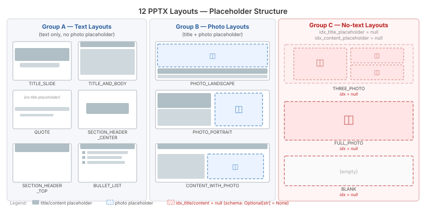

# Experiment 7 — Slide Layout Selection: Prompt Engineering for Accurate Layout Assignment

## Task Context

This experiment targets **Step 5 — Slide Outline + Human-in-the-Loop** from the system architecture (README → System Architecture). This experiment focuses on *what prompt* achieves accurate layout selection within `outlines_with_layout`.

```
Input: paper summaries (*.md, one per paper)        ← Step 4: Summarization
      │
      ▼
┌── 5. SLIDE OUTLINE + HUMAN-IN-THE-LOOP ───────────────────────────────┐
├─── Original (lz-chen) ───────────┬─── My Implementation ──────────────┤
│ GPT-4o: 1 outline per paper      │ Local LLM: 1 title slide           │
│ FunctionCallingProgram           │           + 4 content slides       │
│ HITL: approve / revise with      │ LLMTextCompletionProgram           │
│   feedback                       │ HITL: approve / revise with        │
│ Layout selection by LLM          │   feedback (unchanged)             │
│   (template pptx is not          │ Layout selection by LLM            │
│   provided)                      │   (my own template pptx)           │
└──────────────────────────────────┴────────────────────────────────────┘
      │
      ▼
Output: slide_outlines.json                          → Step 6: PPTX Rendering
```

Within Step 5, the layout selection sub-step (`outlines_with_layout`) is the experiment target:

```
Step 5 — Slide Outline + Human-in-the-Loop (detail)
──────────────────────────────────────────────────────────────────
 paper summaries (*.md, one per paper)
       │
       ▼
 [summary2outline]        LLM → PaperSlideOutline
       │                  { paper_title, paper_authors, paper_year,
       │                    content_slides[4]: List[SlideOutline] }
       ▼                    ↑ loops back on rejection
 [gather_feedback_outline]    Human-in-the-Loop: approve / revise
       │
       ▼
 ┌─── EXPERIMENT TARGET ──────────────────────────────────────────┐
 │ [outlines_with_layout]                                         │
 │   For each content slide:                                      │
 │     LLM selects one of 12 layouts from PPTX template           │
 │   Input:  SlideOutline { title, content }                      │
 │   Prompt: AUGMENT_LAYOUT_PMT                                   │
 │   Output: SlideOutlineWithLayout { title, content,             │
 │                                    layout_name,                │
 │                                    idx_title_placeholder,      │
 │                                    idx_content_placeholder }   │
 └────────────────────────────────────────────────────────────────┘
       │
       ▼
 slide_outlines.json      → Step 6: PPTX Rendering
```

A **PPTX layout** is a slide template that defines which placeholder areas exist on a slide and where they are positioned — title bar, body text region, photo region, or nothing at all. The template (`assets/template.pptx`) used in this project contains 12 layouts grouped into 3 types by the placeholder fields they expose. The diagram below shows all 12 grouped by placeholder structure.



> 📌 **This experiment uses `assets/template.pptx`, a custom template I designed — the original author's codebase does not include a template file.** The 12 layouts, their names, groupings, and placeholder indices (idx=0/1/2) are specific to this template. A different PPTX template may have a different number of layouts, different layout names, and different placeholder positions — the renderer looks up each placeholder by its type (title, body, picture) rather than a hardcoded position, so the same code works regardless of which template is loaded.

Picking the wrong layout breaks the pipeline two ways: an invalid layout name crashes the renderer outright, and a valid-but-mismatched layout produces a slide that visually doesn't fit its content — for example, a text-heavy slide rendered on a layout meant for a single photo.

---

## Summary

- **Problem:** lz-chen's original layout-selection prompt lists layout names and raw placeholder metadata with no description of what each layout is for, giving the model nothing to infer selection criteria from beyond the names themselves.
- **Solution:** Five redesigned prompt strategies are compared against the original prompt across two models and all 12 layout types available in the PPTX template.
- **Result:** Adding layout descriptions alone raises combined accuracy from 61% to 96% — the single largest gain in the experiment; more elaborate strategies add complexity without further improvement.

---

## Experiment Setup

✅ = currently used in the pipeline

### Prompt variants

| Name | Key Design |
|---|---|
| `P0_baseline` | No descriptions, no routing, Norwegian legacy text (`Plassholder for innhold` — from the original project's Inmeta PPTX template) |
| `P1_descriptions_only` ✅ | 12 layout descriptions with Use for / Structure / Signals sub-fields. No routing rules. |
| `P2_decision_tree` | 13-step if/then tree classifying slide into a semantic role → lookup table to layout name |
| `P3_positive_examples` | 12 "USE \<LAYOUT\> when:" semantic rules + descriptions |
| `P4_negative_examples` | 8 "WRONG: Choosing X when Y" elimination rules + descriptions |
| `P5_chain_of_thought` | 4-step free-form reasoning (observe → infer role → match → verify) before selection + descriptions |

P1–P5 share a common `LAYOUT_DESCRIPTIONS` block and an `OUTPUT_FIELDS` block that explicitly instructs `null` for placeholder indices on no-placeholder layouts (THREE_PHOTO, FULL_PHOTO, BLANK).

#### Prompt Texts

<details>
<summary><code>P0_baseline</code> — original <code>AUGMENT_LAYOUT_PMT</code> (lz-chen's unmodified production prompt, verbatim)</summary>

````text
You are an AI that selects the most appropriate slide layout for given slide content.
You will receive a slide with a title and main text body.

Select the layout and placeholder indices based on the content type
(e.g. agenda/overview, regular content, title slide, or closing/thank-you slide).

For content slides:
 - choose a layout that has a content placeholder (also referred to as 'Plassholder for innhold') after the title placeholder
 - choose the content placeholder that is large enough for the text

The following layouts are available: {available_layout_names} with their detailed information:
{available_layouts}

Here is the slide content:
{slide_content}

Output the following fields:
- title: the slide title text (copy verbatim from input)
- content: the slide body text (copy verbatim from input)
- layout_name: the exact name string of the chosen layout (must match one of the available layout names exactly)
- idx_title_placeholder: the numeric index (as a string) of the title placeholder in the chosen layout
- idx_content_placeholder: the numeric index (as a string) of the content placeholder in the chosen layout
````

</details>

<details>
<summary><code>P1_descriptions_only</code>: 12 layout descriptions, no routing rules</summary>

````text
You are an AI that selects the most appropriate slide layout for given slide content.
You will receive a slide with a title and body text.

LAYOUT DESCRIPTIONS — what each layout is for:

1. TITLE_SLIDE
   Use for: Opening cover slide of the presentation, OR closing thank-you/Q&A slide.
   Structure: Large title + subtitle area. NO body content area.
   Signals: author attribution ("Presented by:"), institution, "Thank You", "Q&A", "Conclusion".

2. TITLE_AND_BODY
   Use for: Standard academic or technical content slide with substantial text.
   Structure: Title + large body text area for paragraphs or bullets.
   Signals: multiple sentences or bullet points of academic/technical content.

3. QUOTE
   Use for: Displaying a quotation with attribution.
   Structure: Large quote text area + attribution line (— Author Name).
   Signals: text in quotes followed by "— Name" attribution format.

4. PHOTO_LANDSCAPE
   Use for: A slide whose main content is a single wide/horizontal image or diagram.
   Structure: Title + caption text + landscape (wide) photo placeholder.
   Signals: "[Wide image/diagram/chart]", horizontal layout, description of a wide visual.

5. SECTION_HEADER_CENTER
   Use for: Chapter or section divider slide — title only, centered.
   Structure: Title centered on slide. NO body content area.
   Signals: empty or near-empty body, "Chapter X", "Section X", "Part X".

6. PHOTO_PORTRAIT
   Use for: A slide whose main content is a single tall/vertical image or portrait photo.
   Structure: Title + caption text + portrait (tall) photo placeholder.
   Signals: "[Portrait photo]", headshot, tall/vertical image description.

7. SECTION_HEADER_TOP
   Use for: Chapter or section divider — title at top. Same role as SECTION_HEADER_CENTER.
   Structure: Title at top of slide. NO body content area.
   Signals: same as SECTION_HEADER_CENTER.

8. CONTENT_WITH_PHOTO
   Use for: A slide combining bullet-point text AND an image/figure side by side.
   Structure: Title + text content area + photo placeholder (split layout).
   Signals: slide body contains BOTH bullet points AND a "[Figure/Image: ...]" reference together.

9. BULLET_LIST
   Use for: Bullet-point content slide — similar to TITLE_AND_BODY but optimized for lists.
   Structure: Title + body text area.
   Signals: body is primarily a list of bullet points (* or -).

10. THREE_PHOTO
    Use for: Comparing or displaying three images side by side.
    Structure: Three photo placeholders. NO title, NO text content area.
    Signals: "[Image 1: ...] [Image 2: ...] [Image 3: ...]", three separate image references.

11. FULL_PHOTO
    Use for: A full-bleed image covering the entire slide with no text.
    Structure: Single full-page photo placeholder. NO title, NO text area.
    Signals: "[Full-page image/visualization]", entirely visual slide with no text content.

12. BLANK
    Use for: A completely empty slide with no content.
    Structure: No placeholders except footer.
    Signals: both title and content are empty strings.

The following layouts are available: {available_layout_names}
Layout details:
{available_layouts}

Slide content to classify:
{slide_content}

Output the following fields:
- title: the slide title text (copy verbatim from input)
- content: the slide body text (copy verbatim from input)
- layout_name: the exact name string of the chosen layout (must match one of the available layout names exactly)
- idx_title_placeholder: the numeric index (as a string) of the title placeholder in the chosen layout. 
- idx_content_placeholder: the numeric index (as a string) of the content placeholder in the chosen layout. 
CRITICAL: For layouts THREE_PHOTO, FULL_PHOTO, and BLANK:
  - idx_title_placeholder MUST be null (not a number, not a string)
  - idx_content_placeholder MUST be null (not a number, not a string)
  These layouts have NO title or content placeholders. Outputting any number here is incorrect and will cause a runtime error.
````

</details>

<details>
<summary><code>P2_decision_tree</code>: 13-step if/then role classification + layout lookup</summary>

````text
You are an AI that selects the most appropriate slide layout for given slide content.
You will receive a slide with a title and body text.

STEP 1 — Identify the slide role using this decision tree (evaluate in order, stop at first match):
  A. If both title AND body are empty strings
     → role = BLANK
  B. Else if the body describes a single full-page image that covers the entire slide,
     with no title and no readable text content alongside it
     → role = FULL_PHOTO
  C. Else if the body presents three separate images for comparison or display,
     with no substantial text content
     → role = THREE_PHOTO
  D. Else if the body is a direct quote with an attribution line (e.g. "— Author Name")
     → role = QUOTE_SLIDE
  E. Else if the body contains BOTH bullet-point text (* or -) AND a supporting
     image or figure described alongside the text
     → role = CONTENT_WITH_PHOTO
  F. Else if the body's primary content is a single tall or vertical visual —
     such as a portrait photograph, headshot, or portrait-oriented figure
     → role = PHOTO_PORTRAIT
  G. Else if the body's primary content is a single wide or horizontal visual —
     such as a diagram, chart, pipeline figure, or landscape-oriented image
     → role = PHOTO_LANDSCAPE
  H. Else if the body is empty or very short (< 10 characters and no image references)
     → role = SECTION_BREAK
  I. Else if the title begins with "Chapter", "Section", "Part", "Unit", "Module", or a numbered section marker (e.g. "1.", "2.")
     → role = SECTION_BREAK
  J. Else if the title is "Thank You", "Acknowledgements", "References", "Q&A", "Questions and Answers", or the body is a short closing message (contact info, acknowledgements, bibliography)
     → role = CLOSING_SLIDE
  K. Else if the body contains "Presented by:", "Authors:", "Author:", "Affiliation:", "Institution:", or "Department:" without bullet points
     → role = TITLE_COVER
  L. Else if the body contains bullet points (* or -)
     → role = CONTENT_SLIDE
  M. Else
     → role = CONTENT_SLIDE

STEP 2 — Select layout based on role:
  - role = BLANK               → use layout: BLANK
  - role = FULL_PHOTO          → use layout: FULL_PHOTO
  - role = THREE_PHOTO         → use layout: THREE_PHOTO
  - role = QUOTE_SLIDE         → use layout: QUOTE
  - role = CONTENT_WITH_PHOTO  → use layout: CONTENT_WITH_PHOTO
  - role = PHOTO_PORTRAIT      → use layout: PHOTO_PORTRAIT
  - role = PHOTO_LANDSCAPE     → use layout: PHOTO_LANDSCAPE
  - role = SECTION_BREAK       → use layout: SECTION_HEADER_CENTER or SECTION_HEADER_TOP
  - role = CLOSING_SLIDE       → use layout: TITLE_SLIDE or SECTION_HEADER_CENTER
  - role = TITLE_COVER         → use layout: TITLE_SLIDE
  - role = CONTENT_SLIDE       → use layout: TITLE_AND_BODY or BULLET_LIST

LAYOUT DESCRIPTIONS — what each layout is for:

1. TITLE_SLIDE
   Use for: Opening cover slide of the presentation, OR closing thank-you/Q&A slide.
   Structure: Large title + subtitle area. NO body content area.
   Signals: author attribution ("Presented by:"), institution, "Thank You", "Q&A", "Conclusion".

2. TITLE_AND_BODY
   Use for: Standard academic or technical content slide with substantial text.
   Structure: Title + large body text area for paragraphs or bullets.
   Signals: multiple sentences or bullet points of academic/technical content.

3. QUOTE
   Use for: Displaying a quotation with attribution.
   Structure: Large quote text area + attribution line (— Author Name).
   Signals: text in quotes followed by "— Name" attribution format.

4. PHOTO_LANDSCAPE
   Use for: A slide whose main content is a single wide/horizontal image or diagram.
   Structure: Title + caption text + landscape (wide) photo placeholder.
   Signals: "[Wide image/diagram/chart]", horizontal layout, description of a wide visual.

5. SECTION_HEADER_CENTER
   Use for: Chapter or section divider slide — title only, centered.
   Structure: Title centered on slide. NO body content area.
   Signals: empty or near-empty body, "Chapter X", "Section X", "Part X".

6. PHOTO_PORTRAIT
   Use for: A slide whose main content is a single tall/vertical image or portrait photo.
   Structure: Title + caption text + portrait (tall) photo placeholder.
   Signals: "[Portrait photo]", headshot, tall/vertical image description.

7. SECTION_HEADER_TOP
   Use for: Chapter or section divider — title at top. Same role as SECTION_HEADER_CENTER.
   Structure: Title at top of slide. NO body content area.
   Signals: same as SECTION_HEADER_CENTER.

8. CONTENT_WITH_PHOTO
   Use for: A slide combining bullet-point text AND an image/figure side by side.
   Structure: Title + text content area + photo placeholder (split layout).
   Signals: slide body contains BOTH bullet points AND a "[Figure/Image: ...]" reference together.

9. BULLET_LIST
   Use for: Bullet-point content slide — similar to TITLE_AND_BODY but optimized for lists.
   Structure: Title + body text area.
   Signals: body is primarily a list of bullet points (* or -).

10. THREE_PHOTO
    Use for: Comparing or displaying three images side by side.
    Structure: Three photo placeholders. NO title, NO text content area.
    Signals: "[Image 1: ...] [Image 2: ...] [Image 3: ...]", three separate image references.

11. FULL_PHOTO
    Use for: A full-bleed image covering the entire slide with no text.
    Structure: Single full-page photo placeholder. NO title, NO text area.
    Signals: "[Full-page image/visualization]", entirely visual slide with no text content.

12. BLANK
    Use for: A completely empty slide with no content.
    Structure: No placeholders except footer.
    Signals: both title and content are empty strings.

The following layouts are available: {available_layout_names}
Layout details:
{available_layouts}

Slide content to classify:
{slide_content}

Output the following fields:
- title: the slide title text (copy verbatim from input)
- content: the slide body text (copy verbatim from input)
- layout_name: the exact name string of the chosen layout (must match one of the available layout names exactly)
- idx_title_placeholder: the numeric index (as a string) of the title placeholder in the chosen layout. 
- idx_content_placeholder: the numeric index (as a string) of the content placeholder in the chosen layout. 
CRITICAL: For layouts THREE_PHOTO, FULL_PHOTO, and BLANK:
  - idx_title_placeholder MUST be null (not a number, not a string)
  - idx_content_placeholder MUST be null (not a number, not a string)
  These layouts have NO title or content placeholders. Outputting any number here is incorrect and will cause a runtime error.
````

</details>

<details>
<summary><code>P3_positive_examples</code>: semantic "USE X when" rule per layout</summary>

````text
You are an AI that selects the most appropriate slide layout for given slide content.
You will receive a slide with a title and main text body.

LAYOUT SELECTION RULES — choose the layout whose description best matches the slide's purpose:

USE TITLE_SLIDE when:
  - The slide is the opening cover page of the presentation
  - The slide introduces the paper with its title, author, or institutional information
  - The slide is the closing thank-you, Q&A, or conclusion page
  - The content is presentational rather than informational — short, ceremonial, or attributional text

USE TITLE_AND_BODY when:
  - The slide has a title and a substantial body of academic or technical text
  - The content consists of explanatory paragraphs or a mix of sentences and short phrases
  - The body is informational but not structured primarily as a list

USE BULLET_LIST when:
  - The body is structured as a list of bullet points (* or -)
  - The slide presents multiple parallel items — findings, contributions, steps, or comparisons
  - The content is best read as a list rather than as flowing prose

USE SECTION_HEADER_CENTER or SECTION_HEADER_TOP when:
  - The slide marks the beginning of a new section, chapter, or topic within the presentation
  - The title alone carries the complete message — no body content is needed
  - The body is empty or contains only a very brief subtitle or tagline

USE QUOTE when:
  - The primary content is a quotation attributed to a named person or source
  - The body presents a quoted sentence followed by an attribution line (e.g. "— Author Name")

USE PHOTO_LANDSCAPE when:
  - The main content is a wide or horizontal visual — a diagram, chart, pipeline figure, or landscape image
  - The slide is built around a single horizontal visual element

USE PHOTO_PORTRAIT when:
  - The main content is a tall or vertical visual — a portrait photograph, headshot, or portrait-oriented figure
  - The slide is built around a single vertical visual element

USE CONTENT_WITH_PHOTO when:
  - The slide combines textual bullet points with an image or figure
  - Both a written explanation and a supporting visual are needed on the same slide

USE THREE_PHOTO when:
  - The slide presents three images for side-by-side comparison or display
  - The content is primarily three separate visual elements with no substantial text

USE FULL_PHOTO when:
  - The entire slide is a single full-page image or visualization with no title or body text
  - The visual content fills the whole slide without any text

USE BLANK when:
  - Both the title and the body are empty
  - No content is placed on this slide

LAYOUT DESCRIPTIONS — what each layout is for:

1. TITLE_SLIDE
   Use for: Opening cover slide of the presentation, OR closing thank-you/Q&A slide.
   Structure: Large title + subtitle area. NO body content area.
   Signals: author attribution ("Presented by:"), institution, "Thank You", "Q&A", "Conclusion".

2. TITLE_AND_BODY
   Use for: Standard academic or technical content slide with substantial text.
   Structure: Title + large body text area for paragraphs or bullets.
   Signals: multiple sentences or bullet points of academic/technical content.

3. QUOTE
   Use for: Displaying a quotation with attribution.
   Structure: Large quote text area + attribution line (— Author Name).
   Signals: text in quotes followed by "— Name" attribution format.

4. PHOTO_LANDSCAPE
   Use for: A slide whose main content is a single wide/horizontal image or diagram.
   Structure: Title + caption text + landscape (wide) photo placeholder.
   Signals: "[Wide image/diagram/chart]", horizontal layout, description of a wide visual.

5. SECTION_HEADER_CENTER
   Use for: Chapter or section divider slide — title only, centered.
   Structure: Title centered on slide. NO body content area.
   Signals: empty or near-empty body, "Chapter X", "Section X", "Part X".

6. PHOTO_PORTRAIT
   Use for: A slide whose main content is a single tall/vertical image or portrait photo.
   Structure: Title + caption text + portrait (tall) photo placeholder.
   Signals: "[Portrait photo]", headshot, tall/vertical image description.

7. SECTION_HEADER_TOP
   Use for: Chapter or section divider — title at top. Same role as SECTION_HEADER_CENTER.
   Structure: Title at top of slide. NO body content area.
   Signals: same as SECTION_HEADER_CENTER.

8. CONTENT_WITH_PHOTO
   Use for: A slide combining bullet-point text AND an image/figure side by side.
   Structure: Title + text content area + photo placeholder (split layout).
   Signals: slide body contains BOTH bullet points AND a "[Figure/Image: ...]" reference together.

9. BULLET_LIST
   Use for: Bullet-point content slide — similar to TITLE_AND_BODY but optimized for lists.
   Structure: Title + body text area.
   Signals: body is primarily a list of bullet points (* or -).

10. THREE_PHOTO
    Use for: Comparing or displaying three images side by side.
    Structure: Three photo placeholders. NO title, NO text content area.
    Signals: "[Image 1: ...] [Image 2: ...] [Image 3: ...]", three separate image references.

11. FULL_PHOTO
    Use for: A full-bleed image covering the entire slide with no text.
    Structure: Single full-page photo placeholder. NO title, NO text area.
    Signals: "[Full-page image/visualization]", entirely visual slide with no text content.

12. BLANK
    Use for: A completely empty slide with no content.
    Structure: No placeholders except footer.
    Signals: both title and content are empty strings.

The following layouts are available: {available_layout_names}
Layout details:
{available_layouts}

Slide content:
{slide_content}

Output the following fields:
- title: the slide title text (copy verbatim from input)
- content: the slide body text (copy verbatim from input)
- layout_name: the exact name string of the chosen layout (must match one of the available layout names exactly)
- idx_title_placeholder: the numeric index (as a string) of the title placeholder in the chosen layout. 
- idx_content_placeholder: the numeric index (as a string) of the content placeholder in the chosen layout. 
CRITICAL: For layouts THREE_PHOTO, FULL_PHOTO, and BLANK:
  - idx_title_placeholder MUST be null (not a number, not a string)
  - idx_content_placeholder MUST be null (not a number, not a string)
  These layouts have NO title or content placeholders. Outputting any number here is incorrect and will cause a runtime error.
````

</details>

<details>
<summary><code>P4_negative_examples</code>: 8 "WRONG: choosing X when Y" elimination rules</summary>

````text
You are an AI that selects the most appropriate slide layout for given slide content.
You will receive a slide with a title and body text.

The following are WRONG layout choices to avoid. Each rule states the wrong choice
and explains why it is structurally incorrect. Use the LAYOUT DESCRIPTIONS below
to determine the correct layout after ruling out the wrong ones.

WRONG: Choosing TITLE_AND_BODY or BULLET_LIST when the body contains any image,
  figure, or visual element reference (whether the body is image-only, or a
  combination of bullet-point text and an image reference together).
  Why wrong: TITLE_AND_BODY and BULLET_LIST have no photo placeholder — visual
  content cannot be displayed in these layouts.

WRONG: Choosing TITLE_AND_BODY or BULLET_LIST for the opening cover slide
  (body contains author name, "Presented by:", institutional affiliation, or
  similar attribution — even if the attribution text is short).
  Why wrong: These layouts are designed for informational content, not for
  the presentation's title page.

WRONG: Choosing TITLE_AND_BODY or BULLET_LIST for the closing slide
  (title is "Thank You", "Q&A", "Questions", "References", or "Acknowledgements",
  and body is short — contact info, bibliography, or acknowledgement text only).
  Why wrong: These layouts are designed for informational content, not for
  closing or ceremonial slides.

WRONG: Choosing TITLE_AND_BODY or BULLET_LIST when the body is empty or very
  short (fewer than 10 characters, no bullet points, no image reference).
  Why wrong: These layouts have a large body content area — an empty body
  creates visual dead space on the slide.

WRONG: Choosing TITLE_AND_BODY or BULLET_LIST when the body is a single
  quotation followed by an attribution line (e.g. "— Author Name").
  Why wrong: These layouts do not provide a large-format quote display with
  a dedicated attribution area.

WRONG: Choosing TITLE_SLIDE when the body contains substantial text such as
  multiple bullet points or multiple full sentences of academic or technical
  content. Short attribution lines ("Presented by:", author names, institution
  names) are NOT substantial text and do NOT make this rule apply.
  Why wrong: TITLE_SLIDE has no body content area — substantial body text
  will not be displayed.

WRONG: Choosing TITLE_SLIDE for a chapter or section divider whose body is
  empty and whose title does not include author attribution or closing phrasing.
  Why wrong: TITLE_SLIDE is for the opening cover or closing slide, not for
  internal section transitions.

WRONG: Choosing BLANK for any slide whose title or body contains any text or
  visual content, even if the text is very short (e.g. "Thank You", contact
  info, a single sentence).
  Why wrong: BLANK is strictly for slides where BOTH the title AND the body
  are completely empty strings.

LAYOUT DESCRIPTIONS — what each layout is for:

1. TITLE_SLIDE
   Use for: Opening cover slide of the presentation, OR closing thank-you/Q&A slide.
   Structure: Large title + subtitle area. NO body content area.
   Signals: author attribution ("Presented by:"), institution, "Thank You", "Q&A", "Conclusion".

2. TITLE_AND_BODY
   Use for: Standard academic or technical content slide with substantial text.
   Structure: Title + large body text area for paragraphs or bullets.
   Signals: multiple sentences or bullet points of academic/technical content.

3. QUOTE
   Use for: Displaying a quotation with attribution.
   Structure: Large quote text area + attribution line (— Author Name).
   Signals: text in quotes followed by "— Name" attribution format.

4. PHOTO_LANDSCAPE
   Use for: A slide whose main content is a single wide/horizontal image or diagram.
   Structure: Title + caption text + landscape (wide) photo placeholder.
   Signals: "[Wide image/diagram/chart]", horizontal layout, description of a wide visual.

5. SECTION_HEADER_CENTER
   Use for: Chapter or section divider slide — title only, centered.
   Structure: Title centered on slide. NO body content area.
   Signals: empty or near-empty body, "Chapter X", "Section X", "Part X".

6. PHOTO_PORTRAIT
   Use for: A slide whose main content is a single tall/vertical image or portrait photo.
   Structure: Title + caption text + portrait (tall) photo placeholder.
   Signals: "[Portrait photo]", headshot, tall/vertical image description.

7. SECTION_HEADER_TOP
   Use for: Chapter or section divider — title at top. Same role as SECTION_HEADER_CENTER.
   Structure: Title at top of slide. NO body content area.
   Signals: same as SECTION_HEADER_CENTER.

8. CONTENT_WITH_PHOTO
   Use for: A slide combining bullet-point text AND an image/figure side by side.
   Structure: Title + text content area + photo placeholder (split layout).
   Signals: slide body contains BOTH bullet points AND a "[Figure/Image: ...]" reference together.

9. BULLET_LIST
   Use for: Bullet-point content slide — similar to TITLE_AND_BODY but optimized for lists.
   Structure: Title + body text area.
   Signals: body is primarily a list of bullet points (* or -).

10. THREE_PHOTO
    Use for: Comparing or displaying three images side by side.
    Structure: Three photo placeholders. NO title, NO text content area.
    Signals: "[Image 1: ...] [Image 2: ...] [Image 3: ...]", three separate image references.

11. FULL_PHOTO
    Use for: A full-bleed image covering the entire slide with no text.
    Structure: Single full-page photo placeholder. NO title, NO text area.
    Signals: "[Full-page image/visualization]", entirely visual slide with no text content.

12. BLANK
    Use for: A completely empty slide with no content.
    Structure: No placeholders except footer.
    Signals: both title and content are empty strings.

The following layouts are available: {available_layout_names}
Layout details:
{available_layouts}

Slide content:
{slide_content}

Output the following fields:
- title: the slide title text (copy verbatim from input)
- content: the slide body text (copy verbatim from input)
- layout_name: the exact name string of the chosen layout (must match one of the available layout names exactly)
- idx_title_placeholder: the numeric index (as a string) of the title placeholder in the chosen layout. 
- idx_content_placeholder: the numeric index (as a string) of the content placeholder in the chosen layout. 
CRITICAL: For layouts THREE_PHOTO, FULL_PHOTO, and BLANK:
  - idx_title_placeholder MUST be null (not a number, not a string)
  - idx_content_placeholder MUST be null (not a number, not a string)
  These layouts have NO title or content placeholders. Outputting any number here is incorrect and will cause a runtime error.
````

</details>

<details>
<summary><code>P5_chain_of_thought</code>: 4-step free-form reasoning before selection</summary>

````text
You are an AI that selects the most appropriate slide layout for given slide content.
You will receive a slide with a title and body text.

Before selecting a layout, think step by step and write your reasoning:

Step 1 — Observe: What does this slide contain?
  Describe what you see: the title, the body content type (bullets, quote, image reference,
  empty, short text, etc.), and any notable signals in the text.

Step 2 — Infer purpose: What is the role of this slide in a presentation?
  Think about where this slide would appear and what it is trying to communicate to
  the audience. Consider the full context: is it introducing, summarising, dividing,
  quoting, illustrating, or closing?

Step 3 — Match to layout: Which available layout best serves this purpose?
  Review the layout descriptions below. For each candidate layout, consider whether
  its structure (placeholders, visual format) fits the slide's purpose and content.
  Reason about why the chosen layout fits better than the alternatives.

Step 4 — Verify: Confirm the chosen layout name exactly matches one of the available
  layout names listed below. If not, revise your choice.

LAYOUT DESCRIPTIONS — what each layout is for:

1. TITLE_SLIDE
   Use for: Opening cover slide of the presentation, OR closing thank-you/Q&A slide.
   Structure: Large title + subtitle area. NO body content area.
   Signals: author attribution ("Presented by:"), institution, "Thank You", "Q&A", "Conclusion".

2. TITLE_AND_BODY
   Use for: Standard academic or technical content slide with substantial text.
   Structure: Title + large body text area for paragraphs or bullets.
   Signals: multiple sentences or bullet points of academic/technical content.

3. QUOTE
   Use for: Displaying a quotation with attribution.
   Structure: Large quote text area + attribution line (— Author Name).
   Signals: text in quotes followed by "— Name" attribution format.

4. PHOTO_LANDSCAPE
   Use for: A slide whose main content is a single wide/horizontal image or diagram.
   Structure: Title + caption text + landscape (wide) photo placeholder.
   Signals: "[Wide image/diagram/chart]", horizontal layout, description of a wide visual.

5. SECTION_HEADER_CENTER
   Use for: Chapter or section divider slide — title only, centered.
   Structure: Title centered on slide. NO body content area.
   Signals: empty or near-empty body, "Chapter X", "Section X", "Part X".

6. PHOTO_PORTRAIT
   Use for: A slide whose main content is a single tall/vertical image or portrait photo.
   Structure: Title + caption text + portrait (tall) photo placeholder.
   Signals: "[Portrait photo]", headshot, tall/vertical image description.

7. SECTION_HEADER_TOP
   Use for: Chapter or section divider — title at top. Same role as SECTION_HEADER_CENTER.
   Structure: Title at top of slide. NO body content area.
   Signals: same as SECTION_HEADER_CENTER.

8. CONTENT_WITH_PHOTO
   Use for: A slide combining bullet-point text AND an image/figure side by side.
   Structure: Title + text content area + photo placeholder (split layout).
   Signals: slide body contains BOTH bullet points AND a "[Figure/Image: ...]" reference together.

9. BULLET_LIST
   Use for: Bullet-point content slide — similar to TITLE_AND_BODY but optimized for lists.
   Structure: Title + body text area.
   Signals: body is primarily a list of bullet points (* or -).

10. THREE_PHOTO
    Use for: Comparing or displaying three images side by side.
    Structure: Three photo placeholders. NO title, NO text content area.
    Signals: "[Image 1: ...] [Image 2: ...] [Image 3: ...]", three separate image references.

11. FULL_PHOTO
    Use for: A full-bleed image covering the entire slide with no text.
    Structure: Single full-page photo placeholder. NO title, NO text area.
    Signals: "[Full-page image/visualization]", entirely visual slide with no text content.

12. BLANK
    Use for: A completely empty slide with no content.
    Structure: No placeholders except footer.
    Signals: both title and content are empty strings.

The following layouts are available: {available_layout_names}
Layout details:
{available_layouts}

Slide content:
{slide_content}

Output the following fields:
- title: the slide title text (copy verbatim from input)
- content: the slide body text (copy verbatim from input)
- layout_name: the exact name string of the chosen layout (must match one of the available layout names exactly)
- idx_title_placeholder: the numeric index (as a string) of the title placeholder in the chosen layout. 
- idx_content_placeholder: the numeric index (as a string) of the content placeholder in the chosen layout. 
CRITICAL: For layouts THREE_PHOTO, FULL_PHOTO, and BLANK:
  - idx_title_placeholder MUST be null (not a number, not a string)
  - idx_content_placeholder MUST be null (not a number, not a string)
  These layouts have NO title or content placeholders. Outputting any number here is incorrect and will cause a runtime error.
````

</details>

### Models

| Model | Size | Source |
|---|---|---|
| `gemma3:4b` | 4B | Ollama, local |
| `ministral-3:14b-cloud` | 14B | Ollama, cloud routing |

### Slide types

| Slide type | Content |
|---|---|
| `cover/title_slide` | Paper title + author/presenter attribution |
| `academic_content` | Technical/academic bullet points |
| `section_header` | Chapter/section title only, no body |
| `bullet_list` | Bullet points of findings or metrics |
| `closing_slide` | "Thank You" + contact/discussion prompt |
| `quote_slide` | A quotation with attribution |
| `photo_landscape` | Wide/horizontal image or diagram |
| `photo_portrait` | Tall/vertical portrait image |
| `content_with_photo` | Bullet points + supporting figure |
| `three_photo` | Three images for comparison |
| `full_photo` | Single full-page image, no text |
| `blank` | No title, no content |

### Metrics

**Primary metric — Appropriate Rate:** fraction of runs (out of 3) selecting the correct `layout_name`, per (model × prompt) combination across 12 slide types — 432 LLM calls total (2 models × 6 prompts × 12 slide types × 3 runs, temperature 0.1, sequential).

---

## Full Experimental Results

### `ollama/gemma3:4b` — Appropriate Rate

- **Purpose:** Test all six prompt variants on `gemma3:4b` across 12 slide types — 3 runs each
- **Expected:** At least one redesigned prompt breaks the `TITLE_AND_BODY` bias and reaches ≥95% appropriate rate

| Prompt | cover/ title | academic | section | bullet | closing | quote | photo_ land | photo_ port | content_ photo | three_ photo | full_ photo | blank | Overall | Avg Elap |
|---|:---:|:---:|:---:|:---:|:---:|:---:|:---:|:---:|:---:|:---:|:---:|:---:|:---:|:---:|
| P0 Baseline | 0/3 | 3/3 | 0/3 | 3/3 | 0/3 | 0/3 | 0/3 | 3/3 | 3/3 | 0/3 | 3/3 | 0/3 | **15/36** | 9.5s |
| P1 Descriptions ✅ | 0/3 | 3/3 | 3/3 | 3/3 | 3/3 | 3/3 | 3/3 | 3/3 | 3/3 | 3/3 | 3/3 | 3/3 | **33/36** | 11.1s |
| P2 Decision-Tree | 0/3 | 0/3 | 3/3 | 0/3 | 0/3 | 3/3 | 3/3 | 3/3 | 3/3 | 3/3 | 0/3 | 3/3 | **21/36** | 12.4s |
| P3 Positive Examples | 0/3 | 3/3 | 3/3 | 3/3 | 3/3 | 3/3 | 3/3 | 3/3 | 3/3 | 3/3 | 3/3 | 3/3 | **33/36** | 13.0s |
| P4 Negative Examples | 0/3 | 0/3 | 3/3 | 3/3 | 0/3 | 3/3 | 0/3 | 3/3 | 3/3 | 0/3 | 3/3 | 3/3 | **21/36** | 13.2s |
| P5 Chain-of-Thought | 0/3 | 3/3 | 3/3 | 3/3 | 3/3 | 3/3 | 0/3 | 3/3 | 3/3 | 3/3 | 3/3 | 3/3 | **30/36** | 12.0s |

**Conclusion:** Descriptions Only and Positive Examples tie as best performers for `gemma3:4b` — the cover slide type fails on every prompt, a model size limit rather than a prompt issue.

**Wrong choices by slide type (gemma3:4b):**

| Slide | Expected | P0 | P1 ✅ | P2 | P3 | P4 | P5 |
|---|---|---|---|---|---|---|---|
| `cover/title_slide` | `TITLE_SLIDE` | `TITLE_AND_BODY`×3 | `TITLE_AND_BODY`×3 | `TITLE_COVER`×3 † | `TITLE_AND_BODY`×3 | `TITLE_AND_BODY`×3 | `TITLE_AND_BODY`×3 |
| `academic_content` | `TITLE_AND_BODY`/`BULLET_LIST` | OK | OK | `CONTENT_SLIDE`×3 † | OK | `CONTENT_WITH_PHOTO`×3 | OK |
| `section_header` | `SECTION_HEADER_CENTER`/`SECTION_HEADER_TOP` | `TITLE_AND_BODY`×3 | OK | OK | OK | OK | OK |
| `closing_slide` | `TITLE_SLIDE`/`SECTION_HEADER_CENTER` | `TITLE_AND_BODY`×3 | OK | `CLOSING_SLIDE`×3 † | OK | `BULLET_LIST`×3 | OK |
| `quote_slide` | `QUOTE` | `TITLE_AND_BODY`×3 | OK | OK | OK | OK | OK |
| `photo_landscape` | `PHOTO_LANDSCAPE` | `TITLE_AND_BODY`×3 | OK | OK | OK | `CONTENT_WITH_PHOTO`×3 | `CONTENT_WITH_PHOTO`×3 |
| `three_photo` | `THREE_PHOTO` | `CONTENT_WITH_PHOTO`×3 | OK | OK | OK | `CONTENT_WITH_PHOTO`×3 | OK |
| `bullet_list` | `BULLET_LIST`/`TITLE_AND_BODY` | OK | OK | `CONTENT_SLIDE`×3 † | OK | OK | OK |
| `full_photo` | `FULL_PHOTO` | OK | OK | `PHOTO_LANDSCAPE`×3 | OK | OK | OK |
| `blank` | `BLANK` | `TITLE_SLIDE`×3 | OK | OK | OK | OK | OK |
| (all others) | (matches expected) | OK | OK | OK | OK | OK | OK |

† `TITLE_COVER`, `CONTENT_SLIDE`, `CLOSING_SLIDE` are not valid template layout names — they are intermediate role labels from the decision-tree routing strategy that `gemma3:4b` output as the final `layout_name`.

---

### `ollama/ministral-3:14b-cloud` — Appropriate Rate

- **Purpose:** Verify whether prompt findings from `gemma3:4b` generalize to a larger cloud model
- **Expected:** `ministral-3:14b-cloud` achieves a higher baseline than `gemma3:4b` due to larger model capacity

| Prompt | Overall | Avg Elap |
|---|:---:|:---:|
| P0 Baseline | **29/36 (81%)** | 2.0s |
| P1 Descriptions ✅ | **36/36 (100%)** | 1.7s |
| P2 Decision-Tree | **36/36 (100%)** | 1.6s |
| P3 Positive Examples | **36/36 (100%)** | 2.3s |
| P4 Negative Examples | **36/36 (100%)** | 2.3s |
| P5 Chain-of-Thought | **36/36 (100%)** | 2.0s |

**Conclusion:** Layout descriptions alone are sufficient for the 14B model — prompt style beyond that makes no difference.

**Wrong choices for `ministral-3:14b-cloud` (original prompt only):**

| Slide | Original prompt wrong choice | All five redesigned prompts |
|---|---|---|
| `cover/title_slide` | `TITLE_AND_BODY`×3 | OK (all prompts) |
| `closing_slide` | `TITLE_AND_BODY`×3 | OK (all prompts) |
| `photo_landscape` | `CONTENT_WITH_PHOTO`×1 → 1/3 wrong | OK (all prompts) |

All five redesigned prompts: zero wrong choices across all 180 calls for `ministral-3:14b-cloud`.

---

### Cross-Model Summary

- **Purpose:** Compare prompt performance across both models to identify the best prompt overall
- **Expected:** Descriptions Only or Positive Examples leads on combined score; Decision-Tree Routing and Negative Examples underperform due to known failure modes

| Prompt | Combined | % |
|---|:---:|:---:|
| P0 Baseline | 44/72 | 61% |
| P1 Descriptions ✅ | 69/72 | 96% |
| P2 Decision-Tree | 57/72 | 79% |
| P3 Positive Examples | 69/72 | 96% |
| P4 Negative Examples | 57/72 | 79% |
| P5 Chain-of-Thought | 66/72 | 92% |

**Conclusion:** Descriptions Only and Positive Examples tie as best overall — prompt complexity degrades the small model without improving the large one.

---

## Observations

### Why does decision-tree routing produce invalid layout names?

Decision-tree routing splits layout selection into two steps — first classify the slide's role semantically (opening, closing, content, etc.), then look up which layout matches that role — but `gemma3:4b` stops after the first step and outputs the semantic role itself as the final answer, skipping the lookup entirely.

- Decision-tree routing produces 3 invalid layout names (`TITLE_COVER`, `CONTENT_SLIDE`, `CLOSING_SLIDE`) that don't exist in the template, holding accuracy at 21/36.

### Why do negative-example rules redirect the model to a different wrong layout instead of fixing it?

Eliminating one wrong choice doesn't guarantee the model reasons its way to the correct layout — it can just as easily land on a different, still-wrong one.

- Negative examples redirect `photo_landscape` and `closing_slide` to different wrong layouts (`CONTENT_WITH_PHOTO`, `BULLET_LIST`) instead of the correct one, holding accuracy at 21/36.

### Why does `cover/title_slide` fail on every prompt strategy tested?

This is a model-size limit rather than a prompt-wording problem — even the best-performing strategies fail on this slide type.

- `gemma3:4b` scores 0/18 on `cover/title_slide` across all six prompts tested.
- `ministral-3:14b-cloud` scores 3/3 on the same slide type using the same five redesigned prompts — the identical prompt succeeds once the model is larger.

---

## Decision

### Which prompt design for the layout-selection step?

Descriptions Only is selected — it ties for the best combined accuracy (96%) with Positive Examples, but without the extra latency or rule-writing overhead, following Occam's razor: when two designs perform equally, pick the simpler one.

- Descriptions Only: 69/72 combined (96%), tied with Positive Examples but without Positive Examples' +1.9s average latency on `gemma3:4b`.

---

## Pipeline Integration Status ✅ INTEGRATED

The original layout-selection prompt was replaced by a descriptions-only version in `AUGMENT_LAYOUT_PMT` (`backend/prompts/prompts.py`), eliminating the systematic bias toward `TITLE_AND_BODY` and raising combined accuracy from 61% (44/72) to 96% (69/72).
