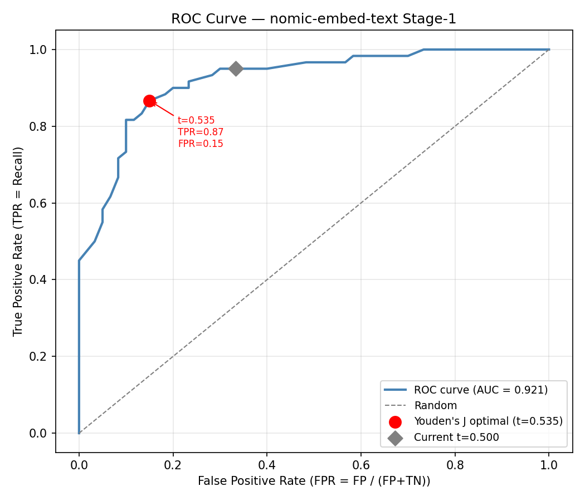
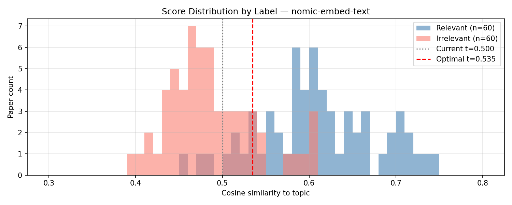

## 6. Production Threshold Analysis

The ablation study in Section 5 establishes E14 (TS-Nomic-Strict) as the best-performing configuration, achieving F1 = 0.974 with perfect precision and 95.0% recall. However, the two-stage routing mechanism used in all experiments relies on ground-truth labels to identify Stage-1 classification errors, which are then forwarded to the Stage-2 LLM for re-judgment. This oracle routing assumption is valid in a controlled experimental setting but is not realisable in production, where labels are unavailable by definition. This section analyses how to replace oracle routing with a score-based band criterion, characterises the embedding model's discriminative behaviour through standard calibration curves, and quantifies the trade-off between Stage-2 LLM load and error coverage that governs the threshold selection decision.

All analyses use the nomic-embed-text embedding model under the Basic input field configuration, consistent with E14's Stage-1 setup. Similarity scores are computed as cosine similarity between the topic embedding and each paper's concatenated text representation. The dataset is the same 120-paper balanced ground-truth set used throughout the ablation study.

---

### 6.1 Oracle Routing vs. Score-Based Band Routing

In the experimental two-stage architecture, Stage-2 routing is defined as:

> Forward paper *i* to Stage-2 if and only if Stage-1's prediction for paper *i* is incorrect.

This requires knowing the ground-truth label for each paper, making it inapplicable outside of evaluation. In production, the system observes only the cosine similarity score *s*(*i*) for each paper. A deployable routing criterion must therefore be formulated exclusively in terms of *s*(*i*).

The natural production analogue is a **score band** [*lo*, *hi*]: papers whose similarity score falls within the band are considered uncertain and forwarded to Stage-2, while papers outside the band are accepted as Stage-1's classification without further review.

```
s(i) ≥ hi   →  Stage-1 prediction kept (confident positive)
s(i) < lo   →  Stage-1 prediction kept (confident negative)
lo ≤ s(i) < hi  →  uncertain; forwarded to Stage-2 LLM
```

The oracle routing of E14 forwards exactly 23 papers (the 20 Stage-1 FP and 3 Stage-1 FN at threshold 0.5). Any score-based band that achieves the same error coverage without ground-truth labels will necessarily forward a larger number of papers, because the band cannot distinguish papers that Stage-1 happened to classify correctly from those that it did not.

---

### 6.2 Embedding Model Calibration

#### 6.2.1 ROC Curve and Optimal Standalone Threshold

Figure 1 shows the Receiver Operating Characteristic (ROC) curve for nomic-embed-text on the 120-paper dataset, obtained by sweeping the classification threshold from 0 to 1 in steps of 0.005 and recording the True Positive Rate (TPR = Recall) and False Positive Rate (FPR = FP / (FP + TN)) at each operating point.



**Figure 1.** ROC curve for nomic-embed-text on the 120-paper balanced dataset (AUC = 0.921). The red circle marks the Youden's J optimal threshold (t = 0.535); the grey diamond marks the threshold used in E14 (t = 0.500). The current operating point lies on the plateau of the curve, achieving higher recall (TPR = 0.950) at the cost of substantially higher FPR (0.333) relative to the Youden-optimal point.

The area under the curve (AUC = 0.921) confirms that nomic-embed-text has strong discriminative power for this topic. Two operating points are annotated:

| Operating point | Threshold | TPR | FPR | F1 |
|---|---|---|---|---|
| Youden's J optimal | 0.535 | 0.867 | 0.150 | 0.860 |
| Current E14 threshold | 0.500 | 0.950 | 0.333 | 0.832 |

The Youden's J statistic (max TPR − FPR) identifies t = 0.535 as the threshold that maximises the separation between true positive rate and false positive rate. At this point, FPR falls from 0.333 to 0.150 — from one in three irrelevant papers being misclassified to one in seven — while TPR decreases from 0.950 to 0.867.

For a standalone classifier, t = 0.535 is objectively superior by Youden's criterion and by F1. However, for the two-stage architecture the optimal Stage-1 threshold is not the standalone-optimal threshold. Stage-2 (Prompt-Strict) eliminates false positives at near-100% effectiveness but recovers false negatives at 0% effectiveness on the Nomic error set (see Section 5.6). The two-stage system therefore benefits from a Stage-1 threshold biased toward high recall — accepting more FP because Stage-2 will correct them — rather than toward balanced TPR/FPR. The current threshold of 0.500, which yields TPR = 0.950 and sends a FP-dominant error set to Stage-2, is more appropriate for this architecture than the Youden-optimal 0.535.

#### 6.2.2 Score Distribution

Figure 2 shows the distribution of cosine similarity scores for relevant and irrelevant papers separately.



**Figure 2.** Cosine similarity score distributions for relevant (blue, n = 60) and irrelevant (salmon, n = 60) papers. The grey dotted line marks the current classification threshold (t = 0.500); the red dashed line marks the Youden-optimal threshold (t = 0.535). The substantial overlap between the two distributions in the interval [0.457, 0.607] motivates the use of a two-stage LLM correction pass.

The relevant papers (blue) are concentrated in the range 0.55–0.65 with a long tail extending down to 0.457. The irrelevant papers (salmon) peak sharply between 0.40 and 0.50, with a tail extending up to 0.607. The two distributions overlap substantially in the interval [0.457, 0.607], a width of 0.15 spanning more than half the effective score range observed in this dataset. Note that this overlap zone coincides numerically with the Stage-1 error score range reported in Section 6.3 — this is a consequence of the threshold t = 0.500 lying **below the midpoint** of the overlap zone (midpoint = 0.532), biased toward capturing more relevant papers at the cost of higher FPR, and is not a general property of embedding-based classifiers.

| Group | Min | Max | Mean | Median |
|---|---|---|---|---|
| Relevant | 0.457 | 0.749 | 0.610 | 0.605 |
| Irrelevant | 0.392 | 0.607 | 0.487 | 0.479 |
| Overlap zone | 0.457 | 0.607 | — | — |

The width of the overlap zone has a direct implication: no single threshold can cleanly separate the two populations. At any fixed threshold within [0.457, 0.607], a non-trivial number of papers from both classes will be misclassified. This observation provides the fundamental justification for the two-stage architecture — the embedding model's uncertainty in the overlap zone is precisely what Stage-2 LLM judgment is designed to resolve.

---

### 6.3 Score-Based Band Routing: Coverage vs. Load

#### 6.3.1 Methodology

For every combination of band boundaries (*lo*, *hi*) in the range [0.30, 0.75] at 0.005 resolution, the following quantities are computed:

- **Stage-2 load**: the number of papers with similarity score in [*lo*, *hi*)
- **Error coverage**: the fraction of Stage-1 errors (at threshold 0.500) whose scores fall within the band

The Pareto frontier is then derived: for each possible load level, the maximum achievable error coverage across all band configurations. This frontier represents the best attainable coverage–load trade-off and is analogous to the ROC curve for the band routing problem.

#### 6.3.2 Results


**Figure 3.** Coverage vs. Load curve for score-based band routing. The solid blue line is the Pareto frontier — the maximum achievable error coverage for each Stage-2 load level. The orange dashed line shows the symmetric band expansion around t = 0.535. The red star marks the E14 oracle operating point (23/120 papers, 100% coverage), which lies above the Pareto frontier and is unreachable without ground-truth labels. The upper x-axis shows the absolute paper count sent to Stage-2.

The Pareto frontier (solid blue) rises steeply from zero and reaches 100% error coverage at a Stage-2 load of approximately 64% of the corpus (77 papers). The symmetric band expansion around the Youden-optimal threshold t = 0.535 (orange dashed) closely tracks the Pareto frontier but requires slightly more load to achieve the same coverage, confirming that the optimal band is not perfectly symmetric around any single threshold.

The oracle routing point of E14 is marked at (19.2%, 100%) — forwarding 23 papers with complete error coverage. This point lies above the Pareto frontier, confirming that it is unreachable by any score-based band without access to ground-truth labels. The gap between the oracle point and the frontier quantifies the cost of deploying without labels.

| Routing strategy | Band | Stage-2 papers | % of corpus | Error coverage | Errors missed |
|---|---|---|---|---|---|
| Oracle (E14, experimental) | — | 23 | 19.2% | 100% (23/23) | 0 |
| Band — full coverage | [0.455, 0.610) | 77 | 64.2% | 100% (23/23) | 0 |
| Band — high coverage | [0.480, 0.610) | 60 | 50.0% | 91.3% (21/23) | 2 FN |
| Band — standard coverage | [0.500, 0.610) | 50 | 41.7% | 87.0% (20/23) | 3 FN |

#### 6.3.3 Recommended Band Configurations

Before selecting a band configuration, it is necessary to characterise which errors are excluded at each coverage level, as the error type determines the downstream impact on final precision and recall.

The three Stage-1 false negative papers have similarity scores in [0.457, 0.500) (empirical maximum 0.484) — below the classification threshold of 0.500. All twenty Stage-1 false positive papers have scores in (0.500, 0.607] (empirical minimum 0.503) — above the threshold. This asymmetry has a direct consequence for band routing:

- The **standard coverage band** [0.500, 0.610) excludes all 3 FN papers (score < 0.500) but includes all 20 FP papers. The lower bound lo = 0.500 coincides with the Stage-1 classification threshold, which naturally separates FP (score ≥ 0.500) from FN (score < 0.500). The upper bound hi = 0.610 is set at the empirical maximum Stage-1 FP score (0.607) plus a small buffer of 0.003, ensuring all FP papers fall within the band. Since Stage-2 with Prompt-Strict achieves 0% FN recovery on the Nomic error set under any routing (Section 5.6), the 3 FN papers excluded by this band would not have been corrected even under oracle routing. The standard band therefore achieves **functionally equivalent final output to oracle routing** — the same 3 FN remain in the output and all 20 FP are submitted for correction — while requiring 50 papers instead of 23 (2.2× overhead).

- The **high coverage band** [0.480, 0.610) additionally captures FN papers with score in [0.480, 0.499], excluding only the 2 lowest-scoring FN papers (score < 0.480). This band sends 60 papers to Stage-2. Since Stage-2 cannot recover Nomic FN papers regardless of which ones are submitted, the practical improvement over the standard band is negligible.

- The **full coverage band** [0.455, 0.610) includes all 23 Stage-1 errors and sends 77 papers to Stage-2. It provides complete routing equivalence with the experimental setup but does not improve final recall beyond the standard band, as the recovered FN papers remain unresolvable by Stage-2.

**Note on generalisability**: the band boundaries [0.500, 0.610) are calibrated on this specific dataset and research topic. The lower bound lo = 0.500 is fixed to the Stage-1 classification threshold and remains valid across topics. The upper bound hi is derived from the empirical maximum FP similarity score and should be re-estimated for each new topic, as the score distribution shifts with topic specificity and corpus composition. A practical re-estimation procedure is to embed a small set of known-irrelevant papers for the new topic, compute their similarity scores, and set hi = max(irrelevant scores) + 0.005. For a general-purpose deployment spanning diverse topics, a multi-topic benchmark would be required to derive a topic-agnostic hi.

**For cloud LLM deployment** (API-based, per-call cost): the standard coverage band [0.500, 0.610) is recommended. It sends 50 papers to Stage-2, corrects all 20 FP errors, and incurs no recall penalty beyond that already present in the experimental result.

**For local LLM deployment on constrained hardware** (e.g., Apple M1 via Ollama): the same standard band [0.500, 0.610) applies. At 50 papers, Stage-2 LLM load is 2.2× the oracle routing overhead rather than the 3.3× implied by a full-coverage band, offering the best achievable cost–quality balance.

**For highest-quality production output with full routing auditability**: the full coverage band [0.455, 0.610) sends all 77 uncertain papers to Stage-2. Final recall and precision are identical to the standard band in this experimental configuration, but the full band ensures no Stage-1 error is excluded from review, which may be preferable in settings where the 3 hard FN are not known in advance to be unrecoverable.

---

### 6.4 Summary

The two-stage architecture evaluated in Section 5 uses oracle routing that is not directly realisable in production. This section establishes a score-based band routing criterion as the production analogue. The nomic-embed-text model achieves AUC = 0.921 on the binary relevance classification task, but its score distributions for relevant and irrelevant papers overlap substantially in [0.457, 0.607], confirming that single-threshold classification is inherently limited in this range. The Youden-optimal standalone threshold (t = 0.535) reduces FPR from 0.333 to 0.150 but at the cost of recall, which is undesirable given Stage-2's asymmetric ability to correct FP but not FN. The threshold of t = 0.500 used in E14 is therefore retained for Stage-1 classification.

For Stage-2 routing, the Coverage vs. Load analysis shows that achieving 100% error coverage requires forwarding 77 papers (64% of corpus) to Stage-2, compared to the 23 papers under oracle routing — a 3.3× increase. However, a critical asymmetry in the Stage-1 error distribution substantially reduces the practical cost. All 20 Stage-1 FP papers have scores above the 0.500 threshold, while all 3 Stage-1 FN papers have scores below it. The standard coverage band [0.500, 0.610), which sends 50 papers to Stage-2 (2.2× oracle overhead), captures all FP errors while excluding the 3 FN papers. Since Stage-2 recovers 0 of 3 Nomic FN papers under any prompt or input configuration (Section 5.6), this band achieves functionally identical final precision and recall to oracle routing. Accepting the nominally lower error coverage (87%) therefore incurs no measurable quality penalty relative to the experimental result, making the standard band the recommended production configuration.
