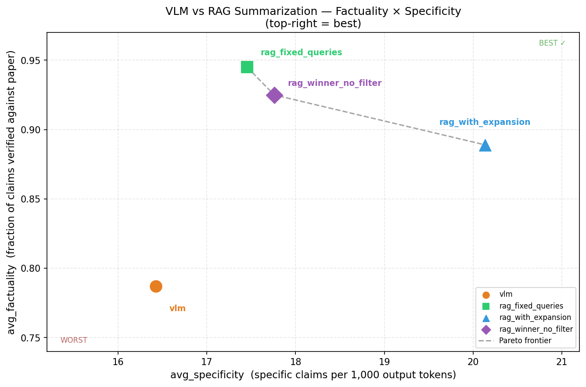

# ML Paper Summarization: VLM vs RAG — Experiment Report

Date: 2026-06-22

> **Purpose of this document:** A developer with no prior context on this codebase or
> experiment should be able to read this document alone and fully understand the
> experiment from start to finish.

---

## 1. Background and Objective

### 1.1 Project Context

This experiment is part of a research-to-presentation pipeline: given a set of ML paper PDFs, the pipeline generates a structured text summary for each paper, then uses that summary to auto-generate a PowerPoint slide deck. The summarization step is the first stage and its quality directly determines what information appears on the slides.

Two architecturally distinct approaches exist for generating those summaries:

```
VLM PATH (vision-based)
────────────────────────────────────────────────────────────────────
PDF
 │
 ▼
pdf2images()  ── converts each page to a PNG at a configurable DPI
 │
 ▼
PNG per page  ── grouped into page batches (≤15 pages per batch)
 │
 ▼
VLM.complete(images + prompt)  ── Ollama gemma4:31b reads images directly
 │                                 (Vision Language Model = multimodal LLM
 │                                  that accepts image + text inputs)
 ▼
partial summaries (one per batch)
 │
 ▼
merge LLM call  ── text-only LLM synthesizes partials into one summary
 │
 ▼
final summary text


RAG PATH (text-chunk-based)
────────────────────────────────────────────────────────────────────
PDF
 │
 ▼
Docling (parse)  ── open-source PDF-to-structured-text library;
 │                   extracts text, tables, and headings
 ▼
HybridChunker (512 tokens)  ── Docling's semantic chunker; splits
 │                               text into ≤512-token chunks while
 │                               respecting sentence and section
 │                               boundaries
 ▼
ChunkFilter  ── removes boilerplate sections: References,
 │               Acknowledgements, page headers/footers
 ▼
Qdrant (store + index)  ── open-source vector database; stores
 │                          chunk embeddings for similarity search
 ▼
Query loop (9 fixed topic queries)
 │   each query → hybrid BM25 + dense retrieval
 │   BM25 = keyword-frequency sparse retrieval
 │   nomic-embed-text = dense embedding model (Ollama)
 │   hybrid = weighted sum of both scores
 ▼
deduplicated chunks (by node ID)
 │
 ▼
LLM (gemma4:31b)  ── text-only LLM generates summary from chunks
 │
 ▼
final summary text
```

### 1.2 Why This Experiment

The VLM path was the original production approach. Its drawbacks on an Apple M1 MacBook (the hardware used throughout this project) are significant: processing a long paper (40–48 pages) takes 12–18 minutes because every page must be encoded as a base64 PNG and sent to the vision model. The VLM also has no section awareness — it reads pages sequentially as images with no mechanism to focus on specific topics.

A RAG (Retrieval-Augmented Generation) path was built as a potential replacement. RAG extracts text upfront, then retrieves only the most relevant text chunks per query, feeding far fewer tokens to the LLM. However, as of this experiment the RAG path had never been formally evaluated for summarization quality. It was unvalidated.

This experiment is the validation gate: before replacing the VLM path with the RAG path in production, we must verify that RAG produces summaries of equal or better factual quality.

### 1.3 Experiment Goal

Determine which summarization approach — VLM (vision-based, reads page images) or RAG (text-chunk-based, retrieves relevant passages) — produces more factually accurate and informationally dense ML paper summaries across a representative set of paper lengths and content types.

---

## 2. Evaluation Setup

### 2.1 Dataset

8 ML papers spanning 4 structural categories were selected. Two papers per category ensures that conclusions are not driven by a single paper's idiosyncrasies, while staying within the compute budget for 4 configs × 8 papers = 32 summarization runs.

| ArXiv ID | Paper Title | Pages | Category | Category Rationale |
|---|---|---|---|---|
| 1608.06993 | Neural Architecture Search with Reinforcement Learning (Zoph & Le) | 9 | short | Tests baseline coverage on concise papers |
| 1801.06146 | Deep Contextualized Word Representations (ELMo) | 12 | short | Tests baseline coverage on concise papers |
| 2103.00020 | Learning Transferable Visual Models From Natural Language (CLIP) | 48 | long | Tests handling of very long papers |
| 2109.01652 | Finetuned Language Models Are Zero-Shot Learners (FLAN) | 46 | long | Tests handling of very long papers |
| 2303.01469 | LLaMA: Open and Efficient Foundation Language Models | 42 | math_table | Tests handling of dense tables and equations |
| 2201.11903 | Chain-of-Thought Prompting Survey | 43 | math_table | Tests handling of dense tables and equations |
| 2109.07958 | Beyond the Imitation Game (BIG-Bench) | 39 | appendix_heavy | Tests handling of papers with long appendices |
| 2112.10752 | Hierarchical Text-Conditional Image Generation (DALL-E 2) | 45 | appendix_heavy | Tests handling of papers with long appendices |

The 4 categories were chosen to ensure that any winner generalizes beyond a single paper type: a method that excels on short papers but fails on appendix-heavy ones is not production-ready.

### 2.2 Fixed Conditions

All four configs share these parameters — they are not varied in this experiment:

| Parameter | Value | Reason Fixed |
|---|---|---|
| VLM and RAG summarization model | `ollama/gemma4:31b-cloud` | Same model for both paths; only the input modality (images vs text) differs, isolating that variable |
| Query expansion LLM | `ollama/qwen3.5:cloud` | Faster model used only for generating query variants, not final summaries |
| Embedding model | `ollama/nomic-embed-text` | Dense vector model for semantic similarity in Qdrant; runs locally via Ollama |
| Sparse retrieval model | `Qdrant/bm25` | Selected over miniCOIL and SPLADE based on a separate sparse-model ablation: BM25 achieved equivalent recall at 15× lower latency. |
| Chunking strategy | Docling HybridChunker, 512 tokens | Selected over SentenceSplitter, SemanticSplitter, and MarkdownElementParser based on a separate chunking ablation: Recall@5 = 0.61 with dense-only retrieval. |
| `similarity_top_k` | 10 | Top 10 chunks retrieved per query |
| Number of retrieval queries | 9 | 8 from production pipeline + 1 added for results-section coverage |
| Number of query expansion variants | 4 | One original + 3 LLM-generated variants per query (for `rag_with_expansion` only) |
| LLM temperature | 0.0 | Deterministic outputs for reproducibility |
| LLM context window | 262,144 tokens (256k) | Required for long papers; set via `num_ctx=262144` |
| Hardware | MacBook M1 | All runs on the same machine; no GPU acceleration |

### 2.3 Metrics

All metrics are computed per paper. Summary statistics (averages across all 8 papers) are in Section 5.

**Factuality evaluation process (NLI classification)**

Before defining individual metrics, it is important to understand how claims are classified. After each summarization run, a Claude claude-sonnet-4-6 subagent reads the full `paper.md` (the Docling text extraction of the paper, with References removed by ChunkFilter) and applies Natural Language Inference (NLI) classification to each specific factual claim in the generated summary. NLI is a text classification task where, given a premise (the paper text) and a hypothesis (a summary claim), the classifier assigns one of three labels:

- **SUPPORTED**: The paper text explicitly confirms the claim.
- **CONTRADICTED**: The paper text explicitly disproves the claim (a hallucination).
- **UNVERIFIABLE**: The claim cannot be confirmed or denied from the paper text (e.g., a claim sourced from the References section, which was removed from `paper.md`).

Each "claim" is an atomic factual statement extracted from the summary: a number, a named method, a comparison result, an architectural detail, etc. One summary sentence may contain multiple claims.

---

**Metric 1: `factuality`**

What it measures: The fraction of specific claims in the summary that were verified as accurate against the paper text.

Formula: `factuality = supported / claim_count`

Example: For `rag_fixed_queries` on paper 1801.06146 (ELMo), `supported=15`, `claim_count=15`, so `factuality = 15/15 = 1.000` (100% of claims verified). For `vlm` on paper 2112.10752 (DALL-E 2), `supported=9`, `claim_count=13`, so `factuality = 9/13 = 0.692` (69.2% of claims verified).

A high factuality (near 1.0) means the summary can be trusted as an accurate representation of the paper. A low factuality means the summary contains errors that would mislead a reader.

---

**Metric 2: `hallucination_rate`**

What it measures: The fraction of specific claims that directly contradict the paper text — the rate of factual errors.

Formula: `hallucination_rate = contradicted / claim_count`

Example: For `vlm` on paper 2103.00020 (CLIP), `contradicted=2`, `claim_count=12`, so `hallucination_rate = 2/12 = 0.167` (16.7% of claims are wrong). For `rag_fixed_queries` on 1801.06146, `contradicted=0`, so `hallucination_rate = 0.000`.

High hallucination_rate is the most dangerous failure mode: the summary actively misleads the reader with incorrect information. This is distinct from unverifiable claims, which are merely uncertain.

---

**Metric 3: `unverifiable_rate`**

What it measures: The fraction of specific claims that could not be confirmed or denied from the paper body text.

Formula: `unverifiable_rate = unverifiable / claim_count`

Example: For `rag_winner_no_filter` on paper 2109.01652 (FLAN), `unverifiable=2`, `claim_count=14`, so `unverifiable_rate = 2/14 = 0.143`. For `rag_fixed_queries` on the same paper, `unverifiable=0`, `unverifiable_rate = 0.000`.

Unverifiable claims typically arise when the model retrieves content from the References section ("Smith et al. 2018 showed X") or generates claims about related work that are not stated in the paper body. High unverifiable_rate signals citation noise in the retrieved context.

---

**Metric 4: `specificity`**

What it measures: The density of specific factual claims per 1,000 output tokens. A high-specificity summary packs more verifiable facts into each unit of text.

Formula: `specificity = claim_count / output_tokens × 1000`

Example: For `rag_fixed_queries` on paper 2112.10752, `claim_count=15`, `output_tokens=659`, so `specificity = 15/659 × 1000 = 22.76`. For `vlm` on paper 2201.11903 (chain-of-thought survey), `claim_count=12`, `output_tokens=851`, so `specificity = 12/851 × 1000 = 14.10`.

A high specificity summary is informationally dense. A low specificity summary may be fluent text but contains relatively few concrete facts. Note: specificity is affected by output_tokens — if a model generates long preamble text, specificity drops even if claims are the same.

---

**Metric 5: `latency_s`**

What it measures: Wall-clock time in seconds from start of summarization call to completion of the final summary text. For VLM long papers, this includes the time for all page-batch calls plus the merge call.

Example: `rag_fixed_queries` on paper 2303.01469 (LLaMA) took `latency_s=14.5`. `vlm` on the same paper took `latency_s=232.7` — a 16× difference.

---

**Metric 6: `retrieved_chunk_count`** (RAG configs only)

What it measures: The number of unique text chunks retrieved across all 9 queries after deduplication by node ID. A higher count indicates broader coverage of the paper's content.

Example: `rag_fixed_queries` on paper 2303.01469 retrieved 52 unique chunks. `rag_with_expansion` on the same paper retrieved only 11 unique chunks — because RRF (Reciprocal Rank Fusion) deduplication collapsed the 4 query variants into a smaller consensus set.

For summarization (which requires coverage of 9 distinct topics), a higher retrieved_chunk_count is generally better. This metric does not apply to the VLM config (no retrieval step).

---

**Metric 7: `output_tokens`**

What it measures: The number of tokens in the generated summary. Used to compute specificity and to detect anomalous outputs (e.g., runaway generation or truncated responses).

Example: `rag_fixed_queries` on paper 2109.01652 produced `output_tokens=1459` — roughly 2× the normal range of 659–862 tokens for other papers. This is a genuine outlier logged as `[ANOMALY]` (see Section 5.1).

---

## 3. Compared Approaches

### 3.1 `vlm`

**What it is:** VLM stands for Vision Language Model — a multimodal AI model that accepts both text and image inputs. This approach converts each PDF page to a PNG image and passes the images directly to the model. No text extraction step occurs; the model "reads" the paper visually, exactly as a human would when looking at a scanned PDF.

**How it works:**

```
PDF
 │
 ▼ pdf2images(dpi=200)
PNG per page  (one file per page, e.g., page_001.png … page_048.png)
 │
 ├─ Short paper (≤15 pages): single call path
 │   └─ VLM.complete(all_pages + SUMMARIZE_PAPER_PMT) → final summary
 │
 └─ Long paper (>15 pages): chunk-and-merge path
     │
     ├─ pages 1–15  → VLM.complete(images + extraction_prompt) → partial_1
     ├─ pages 16–30 → VLM.complete(images + extraction_prompt) → partial_2
     ├─ pages 31–45 → VLM.complete(images + extraction_prompt) → partial_3
     │   [last chunk may be smaller]
     │
     └─ merge_llm.complete(SUMMARIZE_PAPER_PMT + partial_1 + partial_2 + partial_3)
         └─ final summary
```

The key code paths (from `summarize_paper_with_vlm()`):

```python
# Short paper path — single VLM call
if total_pages <= max_pages_per_chunk:
    image_documents = [ImageDocument(image_path=f) for f in all_page_files]
    response = vlm_model.complete(
        prompt=SUMMARIZE_PAPER_PMT, image_documents=image_documents
    )
    return response.text, latency_seconds, _count_output_tokens(response)

# Long paper path — per-batch extraction, then text-only merge
page_chunks = [
    all_page_files[i:i + max_pages_per_chunk]
    for i in range(0, total_pages, max_pages_per_chunk)
]
for chunk_idx, chunk_files in enumerate(page_chunks):
    chunk_prompt = (
        f"This is pages {page_start}–{page_end} of a {total_pages}-page ML research paper. "
        f"Summarize the key content from these pages only. ..."
    )
    resp = vlm_model.complete(prompt=chunk_prompt, image_documents=image_documents)
    partial_summaries.append(f"[Pages {page_start}–{page_end}]\n{resp.text}")

# Final text-only merge (no images)
final_response = merge_llm.complete(
    SUMMARIZE_PAPER_PMT + "\n\n...Synthesize them...\n\n" + merged_context
)
```

**Why it was included:** It is the existing production path. Any replacement must be validated against it as a baseline.

---

### 3.2 `rag_fixed_queries`

**What it is:** RAG stands for Retrieval-Augmented Generation. Instead of passing page images to a model, this approach: (1) extracts structured text from the PDF using Docling (an open-source PDF parser that preserves headings, tables, and text flow); (2) splits the text into overlapping chunks using HybridChunker (Docling's semantic chunker that respects sentence boundaries and caps each chunk at 512 tokens); (3) removes boilerplate sections using ChunkFilter (a rule-based filter that strips References, Acknowledgements, and page headers based on heading matching and keyword patterns); (4) stores chunks in Qdrant (an open-source vector database optimized for hybrid search); (5) retrieves the most relevant chunks for each of 9 predefined topic queries using hybrid BM25 + nomic-embed-text search; and (6) feeds all retrieved chunks to an LLM to generate the final summary.

**How it works:**

```
PDF
 │
 ▼ Docling (parse)
Structured document with headings, tables, text blocks
 │
 ▼ HybridChunker (512 tokens)
~30–55 text chunks per paper (semantically coherent, ≤512 tokens each)
 │
 ▼ ChunkFilter
Chunks with headings matching "References", "Acknowledgements",
"Appendix" or containing reference patterns are removed
 │
 ▼ nomic-embed-text (embed)  +  Qdrant (store)
Dense vectors stored in a per-paper Qdrant collection
 │
 ▼ Query loop (9 fixed topic queries)
    Q1: problem statement and motivation
    Q2: proposed method / model architecture
    Q3: training procedure and hyperparameters
    Q4: datasets and benchmarks used
    Q5: evaluation setup and baselines
    Q6: main findings and key numerical results
    Q7: conclusions and future work
    Q8: authors and affiliations
    Q9: main findings, results, and key outcomes
 │
 ▼ Hybrid retrieval per query
    BM25 (keyword frequency, sparse)
    + nomic-embed-text cosine similarity (dense)
    → top 10 chunks per query → deduplicated by node ID
 │
 ▼ All unique chunks concatenated
 │
 ▼ LLM (gemma4:31b) + SUMMARIZE_PAPER_PMT
 │
 ▼ final summary
```

Key retrieval code (from `retrieve_chunks_fixed_queries()`):

```python
retriever = index.as_retriever(
    vector_store_query_mode="hybrid",
    similarity_top_k=similarity_top_k,  # 10 per query
)
seen_node_ids = set()
unique_chunks = []
for query in RETRIEVAL_QUERIES_FOR_SUMMARIZATION:
    for node_with_score in retriever.retrieve(query):
        if node_with_score.node_id not in seen_node_ids:
            seen_node_ids.add(node_with_score.node_id)
            unique_chunks.append(node_with_score.text)
return unique_chunks
```

**Why it was included:** This is the primary RAG candidate — 9 fixed topic queries with ChunkFilter. It is the configuration hypothesized to replace VLM.

---

### 3.3 `rag_with_expansion`

**What it is:** Identical to `rag_fixed_queries` except that each of the 9 base queries is expanded into 4 variants using an LLM (`qwen3.5:cloud`), and all 4 variants' results are merged using Reciprocal Rank Fusion (RRF). RRF is a rank-merging technique: for each chunk that appears in multiple result lists, its score is the sum of `1 / (rank + 60)` across all lists. This rewards chunks that appear highly ranked in multiple query variants, surfacing chunks that multiple phrasings agree are relevant.

**How it works:**

```
For each of the 9 base queries:
  │
  ▼ qwen3.5:cloud generates 3 query variants
  original query + 3 variants = 4 queries total
  │
  ▼ 4 independent hybrid retrievals (top 10 each)
  up to 40 candidate chunks per base query
  │
  ▼ RRF fusion
  chunks appearing in multiple retrieval lists score higher
  final ranked list has fewer, but more consensual, chunks
  │
  ▼ deduplication by node ID across all 9 base queries
  │
  ▼ LLM (gemma4:31b) + SUMMARIZE_PAPER_PMT → final summary
```

Key retrieval code (from `retrieve_chunks_with_query_expansion()`):

```python
for query in RETRIEVAL_QUERIES_FOR_SUMMARIZATION:
    fusion_retriever = QueryFusionRetriever(
        [base_retriever],
        num_queries=4,           # 1 original + 3 LLM-generated variants
        mode="reciprocal_rerank",
        use_async=False,         # local Qdrant file mode cannot handle concurrent access
        llm=query_expansion_llm,
    )
    for node_with_score in fusion_retriever.retrieve(query):
        if node_with_score.node_id not in seen_node_ids:
            seen_node_ids.add(node_with_score.node_id)
            unique_chunks.append(node_with_score.text)
```

**Why it was included:** Tests whether generating semantically diverse query variants helps retrieve more relevant chunks. The hypothesis was: different phrasings of the same question might surface different relevant passages, improving coverage.

**Why retrieved_chunk_count is much lower (average 11.4 vs 43.6 for `rag_fixed_queries`):** RRF deduplication is the cause. When 4 query variants retrieve overlapping chunks (because they are semantically similar), the deduplication step collapses the union into a small consensus set. For summarization — which requires broad coverage across 9 distinct topics — this is counterproductive. RRF optimizes for precision (finding the single most relevant chunk) rather than recall (covering all topics). The result is summaries with fewer retrieved chunks and, in this experiment, lower factuality than `rag_fixed_queries`.

---

### 3.4 `rag_winner_no_filter`

**What it is:** Identical to `rag_fixed_queries` — 9 fixed queries, no query expansion, hybrid BM25 + dense retrieval — with one change: ChunkFilter is disabled. The References, Acknowledgements, and boilerplate sections are NOT removed before indexing. This tests whether ChunkFilter is actually necessary.

**How it works:** Identical to `rag_fixed_queries` except that more chunks are indexed per paper (References sections are included). When the retriever searches for, say, "main findings and key numerical results," it may retrieve a chunk from the References section such as "Brown et al. (2020) showed that GPT-3 achieves 88% on SuperGLUE." This claim cannot be verified in `paper.md` — because `paper.md` was generated by ChunkFilter and does not contain the References section — so it is classified as UNVERIFIABLE by the NLI evaluator.

**Why it was included:** To isolate the effect of ChunkFilter. If ChunkFilter has no effect on summary quality, then the filter adds complexity without benefit. The specific hypothesis: removing ChunkFilter will increase `unverifiable_rate` (because citation noise from References sections will appear in retrieved chunks), but may not meaningfully increase `hallucination_rate` (because references to other papers are not factually wrong — they just cannot be verified from the paper body).

---

## 4. Technical Issues Encountered

### Issue 1: Ollama HTTP 400 "request body too large" for long papers

**Symptom:** During VLM summarization of LLaMA (42 pages) and DALL-E 2 (45 pages), the script crashed with `OllamaException: {"error": "http: request body too large"}`. Short papers (9–12 pages) completed successfully in the same session.

**Root Cause:**

```
PDF page rendered at DPI=200
  │
  ▼ PNG image
  Typical ML paper page: ~0.89 MB base64-encoded
  Math/figure-heavy page (tables, equations): ~2–4 MB base64-encoded
  │
  ▼ HTTP POST body = sum of all page images
  15 pages × 4 MB = 60 MB  →  exceeds Ollama's 16 MB limit
   9 pages × 0.89 MB = 8 MB  →  within limit  ✓
  12 pages × 0.89 MB = 11 MB  →  within limit  ✓

Ollama 0.30.x has a hardcoded 16 MB HTTP request body limit.
OLLAMA_MAX_REQUEST_SIZE environment variable does NOT exist in v0.30.x
(confirmed by source code review — the env var was added in a later version).
```

**Fix Applied:**

Two CLI arguments were added to control the page batch size and image resolution independently:

- `--vlm-pages-per-chunk` (default=15): reduces how many pages are in each VLM call
- `--vlm-dpi` (range 50–200, default=200): reduces image resolution to shrink file sizes

The fix required reducing both dimensions simultaneously to stay under 16 MB:

```
DPI=200, 15 pages/chunk → FAIL  (math papers: >16 MB)
DPI=200,  5 pages/chunk → FAIL  (still >16 MB for dense math pages)
DPI=150, 15 pages/chunk → FAIL  (still too large)
DPI=150,  5 pages/chunk → SUCCESS ✓
```

Long papers (LLaMA, DALL-E 2, BIG-Bench, CLIP, FLAN, chain-of-thought) were rerun with `--vlm-pages-per-chunk 5 --vlm-dpi 150`.

**Why this fix:** Client-side control via CLI arguments is more robust than relying on server-side environment variables whose availability depends on the Ollama version. Two independent parameters allow future runs to tune resolution and batch size separately without code changes.

---

### Issue 2: VLM chunk-and-merge uses a different prompt path than single-call VLM

**Symptom:** Short papers (≤15 pages) and long papers (>15 pages) follow different code paths in the VLM config, even though the final output format is intended to be the same.

**Root Cause:**

```
Short paper (≤15 pages):
  VLM reads ALL pages at once
  Prompt: SUMMARIZE_PAPER_PMT (full structured prompt)
  Output: one structured summary  ─────────────────────────┐

Long paper (>15 pages):                                     │ different
  VLM reads pages 1–15 with generic "extract content" prompt  │ processing
  VLM reads pages 16–30 with generic "extract content" prompt  │ path
  ...                                                        │
  Text-only LLM merges partials using SUMMARIZE_PAPER_PMT  ──┘
```

For short papers, the VLM directly applies the full structured prompt to all images in a single context window — the model sees the complete paper. For long papers, each batch receives a generic extraction prompt ("Summarize the key content from these pages only"), producing a partial intermediate text. A text-only LLM (not a VLM) then synthesizes those partials using the full prompt. The final merge step uses no images — only text from the partial summaries.

**Why this is a design limitation, not a bug:** Ollama's 16 MB limit makes a single VLM call impossible for long papers at any reasonable resolution. The chunk-then-merge pattern is the only way to handle long papers within the hardware constraint. The consequence is that the VLM path is not uniform across paper types: short papers get full paper context in one model pass, while long papers lose fine-grained visual context in the merge step (the merge LLM receives only text, not the original images). This is a systematic source of variance between paper categories for the VLM config, not a randomness issue.

---

## 5. Results

### 5.1 Overall Summary

Average metrics across all 8 papers per config:

| Config | avg_factuality | avg_hallucination_rate | avg_unverifiable_rate | avg_specificity | avg_latency_s | avg_output_tokens | avg_retrieved_chunks |
|---|---|---|---|---|---|---|---|
| vlm | 0.787 | 0.136 | 0.078 | 16.427 | 242.3 † | 787.9 | N/A |
| rag_fixed_queries | 0.945 | 0.036 | 0.019 | 17.453 | 14.7 | 852.8 | 43.6 |
| rag_with_expansion | 0.889 | 0.049 | 0.062 | 20.134 | 36.9 | 694.1 | 11.4 |
| rag_winner_no_filter | 0.925 | 0.020 | 0.055 | 17.759 | 13.9 | 764.3 | 46.3 |

† VLM `avg_latency_s=242.3` is based on only 2 papers (2303.01469 = 232.7s, 2112.10752 = 251.8s). The other 6 papers ran in a separate script run whose timing logs were not captured. The 2 observed values are from math-heavy and appendix-heavy papers — likely slower than short papers due to more pages per batch. The true average for all 8 papers is unknown and likely lower, but still expected to be well above 14.7s.

**Note on the `rag_fixed_queries` output_tokens outlier:** Paper 2109.01652 (FLAN) produced `output_tokens=1459`, approximately 2× the normal range of 659–862 for other papers. The factuality for this paper is 0.929 (13/14 claims supported), so the model did not hallucinate — it simply generated a longer-than-usual summary. The high token count suppresses this paper's specificity to 9.596 (vs the overall `rag_fixed_queries` average of 17.453), pulling down the config average. This is a genuine model output variation, not a data error.

---

### 5.2 2D Scatter Plot: Factuality vs Specificity



Each point represents one summarization config averaged across all 8 papers:

- **x-axis (avg_specificity):** specific factual claims per 1,000 output tokens — higher means denser, more information-packed summaries
- **y-axis (avg_factuality):** fraction of claims verified as correct against the full paper — higher means more accurate

The dashed lines mark the midpoint of each axis, dividing the space into four quadrants:

| Quadrant | Meaning |
|---|---|
| Top-right (BEST) | Accurate **and** specific — the ideal |
| Top-left (safe but shallow) | Accurate but low claim density — LLM hedges with vague language |
| Bottom-right (dangerous) | Many claims but low accuracy — confidently wrong |
| Bottom-left (WORST) | Few claims and inaccurate |

**Key observations:**

- `rag_fixed_queries` (green square) is closest to the top-right quadrant: factuality=0.945, specificity=17.453 — the best overall balance.
- `rag_with_expansion` (blue triangle) is the most specific (20.134) but has lower factuality (0.889). RRF deduplication retrieved only 11.4 chunks on average (vs 43.6 for `rag_fixed_queries`), leading to shorter and denser summaries but with slightly more unverified claims.
- `rag_winner_no_filter` (purple diamond) has slightly lower factuality than `rag_fixed_queries` (0.925 vs 0.945) and higher unverifiable_rate (0.055 vs 0.019), confirming that removing ChunkFilter introduces citation noise from References sections.
- `vlm` (orange circle) is bottom-left: lowest factuality (0.787) and lowest specificity (16.427). Vision-based reading of PDF images produces more vague language and more factual errors than text-chunk retrieval.

---

### 5.3 Per-Category Breakdown

Factuality averages computed from individual `[RESULT]` lines, grouped by `paper_category` (2 papers per category):

| paper_category | vlm | rag_fixed_queries | rag_with_expansion | rag_winner_no_filter |
|---|---|---|---|---|
| short (1608.06993, 1801.06146) | 0.778 | 0.965 | 0.803 | 0.959 |
| long (2103.00020, 2109.01652) | 0.837 | 0.887 | 0.967 | 0.893 |
| math_table (2303.01469, 2201.11903) | 0.801 | 0.928 | 0.892 | 0.887 |
| appendix_heavy (2109.07958, 2112.10752) | 0.730 | 1.000 | 0.895 | 0.962 |

Key observations:

- **`rag_fixed_queries` wins or ties in 3 of 4 categories.** The exception is `long` papers, where `rag_with_expansion` achieves 0.967 vs 0.887 — the only category where query expansion helps.
- **VLM is worst in every category** and is particularly weak on appendix-heavy papers (0.730), likely because appendices contain tables, figures, and dense numerical content that is harder to interpret from low-DPI images.
- **`rag_fixed_queries` achieves perfect factuality (1.000) on appendix-heavy papers.** This is the largest gap: 1.000 vs VLM's 0.730 — a +27.0 percentage point advantage on the hardest paper type.
- **For long papers**, `rag_with_expansion` (0.967) narrowly beats `rag_fixed_queries` (0.887). This may be because long papers have more content spread across sections, and query variants help locate relevant chunks that fixed queries miss. However, 2 papers is too small a sample to draw a firm conclusion.

---

### 5.4 ChunkFilter Impact: `rag_fixed_queries` vs `rag_winner_no_filter`

> For the full ChunkFilter analysis — heading frequency statistics, corpus-level drop rates, and implementation design decisions — see [`../rag-filtering/chunk-filter-analysis.md`](../rag-filtering/chunk-filter-analysis.md).

These two configs are identical except for ChunkFilter on/off. Comparing them directly isolates the effect of filtering boilerplate sections before indexing:

| Metric | rag_fixed_queries (ChunkFilter ON) | rag_winner_no_filter (ChunkFilter OFF) | Difference |
|---|---|---|---|
| avg_factuality | 0.945 | 0.925 | −0.020 |
| avg_hallucination_rate | 0.036 | 0.020 | −0.016 |
| avg_unverifiable_rate | 0.019 | 0.055 | +0.036 |
| avg_retrieved_chunks | 43.6 | 46.3 | +2.7 |

Interpretation:

Removing ChunkFilter increases `unverifiable_rate` by 0.036 absolute (from 1.9% to 5.5%) — a +189% relative increase. Simultaneously, `hallucination_rate` actually decreases by 0.016 when ChunkFilter is off. This confirms the hypothesis: References sections inject citation noise (claims about other papers that cannot be verified from the paper body), not factual errors about the paper being summarized. The retrieved chunks from References sections contain accurate statements about the literature — but those statements cannot be checked against the paper's body text, so they register as UNVERIFIABLE rather than CONTRADICTED.

The net effect on `factuality` is a −0.020 drop (from 0.945 to 0.925) when ChunkFilter is removed, because `factuality = supported / claim_count` is reduced when `unverifiable` claims replace `supported` claims.

**Conclusion on ChunkFilter:** ChunkFilter is worth keeping. It prevents unverifiable citation noise from entering the retrieved context, improving factuality by +0.020 with no additional cost at summarization time.

---

### 5.5 Winner

**`rag_fixed_queries`** — avg_factuality=0.945, avg_hallucination_rate=0.036, avg_unverifiable_rate=0.019, avg_specificity=17.453, avg_latency_s=14.7s, avg_retrieved_chunks=43.6

Reasons `rag_fixed_queries` is the recommended approach:

1. **Highest factuality across all 8 papers:** 0.945 vs VLM's 0.787 — a +15.8 percentage point improvement. Meaning 94.5% of specific claims in the RAG summary were verified against the paper, compared to 78.7% for VLM.

2. **Lowest unverifiable_rate (0.019):** ChunkFilter is effective at suppressing citation noise. Only 1.9% of claims could not be verified — meaning the summary stays grounded in the paper body.

3. **16.5× faster than VLM** (14.7s vs 242.3s†): Text retrieval and generation is dramatically faster than rendering pages to images and sending them through a vision model. On M1 hardware where VLM inference is slow, this difference is critical for a production pipeline.

4. **Adequate retrieved_chunk_count (43.6):** 43–44 unique chunks across 9 topic queries provides sufficient coverage of the full paper. This compares favorably to `rag_with_expansion`'s 11.4 average — more content for the LLM to draw from when writing the summary.

5. **`rag_with_expansion` is not better overall:** While it achieves higher specificity (20.1 vs 17.5) and wins on `long` papers, its factuality (0.889) is 5.6 percentage points lower than `rag_fixed_queries`, and its retrieved_chunk_count (11.4) indicates poor coverage. For a summarization task that requires breadth across 9 topics, precision-optimized RRF retrieval is counterproductive.

---

## 6. Limitations

- **Small sample size (8 papers, 4 categories × 2 each):** With only 2 papers per category, per-category conclusions have high variance. A single paper's characteristics can dominate the category average. The exception to `rag_fixed_queries`' dominance on long papers (where `rag_with_expansion` scored 0.967 vs 0.887) may not hold with a larger long-paper sample.

- **VLM latency is unreliable:** `avg_latency_s=242.3` for VLM is based on only 2 papers (the 6 that ran in a separate script run have no logged latency). True average for all 8 papers is unknown. The 2 measured papers are math-heavy and appendix-heavy (among the hardest categories), so the true average might be somewhat lower — but even at 100s/paper, VLM would still be 6.8× slower than `rag_fixed_queries`.

- **Factuality evaluation by Claude subagents:** The judge is Claude claude-sonnet-4-6 (same model family as the assistant writing this report). Inter-rater reliability was not measured. A human expert annotator or a different model family would provide a more independent evaluation and could reduce potential systematic bias.

- **Single summarization prompt for both paths:** Both VLM and RAG use `SUMMARIZE_PAPER_PMT`, which requests 8 structured sections and was designed for text-mode LLMs. The VLM path repurposes this text prompt for image input. A prompt designed specifically for visual reading of PDF pages (e.g., referencing visual elements, figure numbers, table captions) might close the VLM factuality gap.

- **VLM chunk-and-merge introduces path divergence:** Papers above `max_pages_per_chunk` use a two-step process (per-chunk extraction + text-only merge), while short papers use a single VLM call. The merge step processes text, not images. This means the VLM path is not uniform across paper types, adding a confound when comparing short vs long paper performance within the VLM config.

- **`rag_with_expansion` RRF deduplication counterproductive for summarization:** The 11.4 average retrieved chunks (vs 43.6 for `rag_fixed_queries`) shows that query expansion with RRF reduces coverage rather than expanding it. This finding is specific to the summarization task (which requires broad topical coverage). Query expansion with RRF may still benefit precision-oriented retrieval tasks (e.g., question answering where only one correct answer exists). This result should not be generalized to all retrieval tasks.

---

## 7. Conclusion and Next Steps

**Conclusion:**

This experiment compared four summarization approaches on 8 ML papers across 4 paper structural types (short, long, math/table-heavy, appendix-heavy). RAG with 9 fixed topic queries and ChunkFilter enabled (`rag_fixed_queries`) achieved the highest factuality (0.945, meaning 94.5% of claims verified), the lowest hallucination rate (0.036), the lowest unverifiable rate (0.019), and ran 16.5× faster than VLM (14.7s vs 242.3s). The VLM approach — the current production path — produced the lowest factuality (0.787) and highest hallucination rate (0.136) of all four configs. The RAG approach is ready to replace the VLM path in production.

**Recommended for next phase:**

`rag_fixed_queries` — because it achieves the highest factuality, the lowest citation noise rate (unverifiable_rate=0.019), and 16.5× faster latency than VLM, all on the same M1 hardware with no additional model dependencies beyond what is already used in the pipeline.

**Open questions:**

- Does the factuality advantage of `rag_fixed_queries` hold for papers outside ML (e.g., biology, economics, materials science) where text structure and vocabulary differ significantly?
- Would a VLM-specific prompt (written to leverage visual information: figure captions, chart labels, colored highlights) close the factuality gap between VLM and `rag_fixed_queries`?
- Can query expansion be redesigned to maximize topical coverage rather than consensus? For example: disabling RRF and simply taking the union of all query results (no deduplication across variants) might recover the 43+ chunk coverage while still benefiting from semantic diversity.
- Is 2 papers per category sufficient to conclude that `rag_fixed_queries` beats VLM across all paper types? The `long` category result (0.887 for `rag_fixed_queries` vs 0.967 for `rag_with_expansion`) suggests that 2 papers may not be enough to determine which method is better for long papers specifically.
- For the production pipeline, what is the acceptable tradeoff between `specificity` (where `rag_with_expansion` scores 20.1 vs 17.5 for `rag_fixed_queries`) and `factuality` (0.889 vs 0.945)? This is a product decision, not a technical one.

---

## 8. Design Decisions and Rationale

> This section documents the reasoning behind every major design choice in this experiment.
> Each sub-section describes a decision, why it was made, what alternatives were considered, and what trade-offs were accepted.

---

### 8.1 Same model for both VLM and RAG paths

Both the VLM path and the RAG path use `ollama/gemma4:31b-cloud` for summary generation. The more natural setup would be to use a dedicated text LLM for the RAG synthesis step and reserve the vision model only for the VLM path — vision models are generally slower and more resource-intensive than text-only LLMs.

The reason for using the same model: if the two paths use different models, any measured difference in factuality or specificity is a confound. We cannot tell whether RAG outperforms VLM because text-chunk input is a better format, or because its LLM happens to be stronger on this summarization task. Using the same model ensures that input modality is the only variable that differs between paths.

The same constraint applies to the prompt: both paths use the identical `SUMMARIZE_PAPER_PMT` (an 8-section structured summary prompt written for text-mode LLMs). A prompt written specifically for image input might improve VLM scores but would introduce a second confounding variable. This is acknowledged as a limitation in Section 6 — the VLM path may be slightly disadvantaged by a prompt not optimized for visual reading.

**Trade-off accepted:** `gemma4:31b-cloud` is overspecified for text-only summarization — a smaller text LLM would be faster and cheaper. This added latency to the RAG path. We accepted this cost to keep the comparison valid.

---

### 8.2 Nine retrieval queries instead of eight

The RAG path uses 9 fixed queries (Q1–Q9). The production pipeline's retrieval module originally used 8 queries (Q1–Q8). A 9th query was added for this experiment:

> "What are the main findings, results, and key outcomes of this work?"

The problem with 8 queries: Q6 asks about evaluation *setup* (which benchmarks, which metrics). In most ML papers, the evaluation setup and the actual numerical results appear in different subsections — often with a chunk boundary between them. A single query retrieving "evaluation setup" would reliably fetch benchmark descriptions but miss the result tables. Q9 directly targets the results section, ensuring the LLM receives the actual numbers, model comparisons, and outcome claims when generating the summary.

Without Q9, the RAG-generated summaries systematically underrepresented quantitative results. Adding Q9 improved coverage of the results section with no overlap with the other 8 queries — each of Q1–Q8 targets a structurally distinct part of a paper.

---

### 8.3 Per-paper Qdrant collections over a shared collection with metadata filtering

Each paper gets its own Qdrant collection (e.g., collection name = `"1608.06993"`). An earlier design used one shared collection with `MetadataFilter(key="paper_id")` to isolate chunks per paper at query time.

The shared-collection approach failed silently. LlamaIndex treats `document_id` as a reserved internal field — it is stored in LlamaIndex's internal node metadata but is not propagated to Qdrant's payload as a filterable key. As a result, `MetadataFilter(key="document_id")` either returned empty results or cross-paper chunks without raising an error (LlamaIndex GitHub Issue #17025).

Per-paper collections eliminate the metadata filter entirely: the collection boundary is the isolation mechanism. There is no filter logic to get wrong, no silent failure mode, and collection names are human-readable for debugging. The trade-off is that Qdrant must manage one collection per paper (8 collections in this experiment), but this is negligible overhead for local in-process Qdrant running in file mode.

---

### 8.4 Claude subagents as the factuality judge

Factuality evaluation — classifying each summary claim as SUPPORTED, CONTRADICTED, or UNVERIFIABLE against the full paper text — was performed by Claude claude-sonnet-4-6 subagents that read the complete `paper.md` file (the Docling-extracted paper body, with References removed by ChunkFilter, up to ~200k tokens).

Three alternatives were considered and rejected:

**Standard FactScore (Meta, 2023):** FactScore retrieves a relevant passage per claim using a separate retrieval system, then judges the claim against that passage. If retrieval misses the relevant passage, a true claim is wrongly marked NOT_SUPPORTED (a false negative). For this experiment, eliminating retrieval from the evaluation step was a deliberate design choice: Claude reads the entire paper in one pass, so no passage can be missed due to retrieval failure.

**Local models (Ollama):** Local models such as `nemotron-3-super:cloud` and `ministral-3:14b-cloud` were evaluated in a separate retrieval evaluation experiment for RAGAS tasks but were not tested for full-paper NLI classification. Their 32k context window would require chunking the paper, reintroducing the same retrieval problem that FactScore has.

**RAGAS metrics:** RAGAS faithfulness requires retrieved chunks as the reference document. The VLM path has no retrieved chunks — it processes page images directly. Using a chunk-dependent metric would make the metric undefined for the VLM path and prevent cross-path comparison.

**Trade-off accepted:** The factuality judge (Claude claude-sonnet-4-6) is from the same model family as the assistant writing this report. Inter-rater reliability was not measured, and a different model family or human annotators would provide a more independent evaluation. This is a known limitation (Section 6).

---

### 8.5 Factuality formula: supported / (supported + contradicted + unverifiable)

The factuality denominator includes UNVERIFIABLE claims alongside SUPPORTED and CONTRADICTED, following the FactScore (Meta, 2023) convention:

```
factuality = supported / (supported + contradicted + unverifiable)
```

An alternative formula would be `supported / (supported + contradicted)` — treating unverifiable claims as neither correct nor incorrect and excluding them from the denominator.

We rejected that alternative because, from a user's perspective, an unverifiable claim in a paper summary is a quality failure. The user reads a summary claim, tries to verify it against the paper, and cannot find any supporting text. Whether the LLM generated it from its training data (parametric knowledge) or retrieved it from a References section, the result is the same: a summary that cannot be fully trusted. Excluding unverifiable claims from the denominator would artificially inflate factuality scores for configs that produce more parametric or citation-sourced content.

Treating unverifiable claims as a failure mode (reducing factuality) also makes the ChunkFilter effect measurable: `rag_winner_no_filter` (ChunkFilter OFF) has unverifiable_rate=0.055 vs `rag_fixed_queries` (ChunkFilter ON) at 0.019, which directly lowers the no-filter config's factuality score.

---

### 8.6 Hallucination rate and unverifiable rate as separate metrics

Both `hallucination_rate = contradicted / total` and `unverifiable_rate = unverifiable / total` are reported separately rather than combined into a single "error rate."

The two failure modes have different root causes and different remedies:

| Failure mode | Root cause | Remedy |
|---|---|---|
| CONTRADICTED (hallucination) | LLM misread numbers, flipped comparisons, or confused one paper with another | Better retrieval quality, smaller chunks, re-ranking |
| UNVERIFIABLE (citation noise) | LLM retrieved content from References or Acknowledgements sections, or drew on parametric knowledge | ChunkFilter to strip References before indexing |

The ChunkFilter ablation in this experiment (Section 5.4) demonstrates why separation matters. When ChunkFilter is removed (`rag_winner_no_filter`), unverifiable_rate increases from 0.019 to 0.055 (+189%) while hallucination_rate barely changes (0.036 to 0.020). If these were collapsed into one error rate, the ChunkFilter's specific effect on citation noise would be invisible — we would see a small net change and incorrectly conclude that ChunkFilter has marginal impact.

Separate metrics give developers a diagnostic signal: a high hallucination_rate points to retrieval quality problems; a high unverifiable_rate points to insufficient boilerplate filtering.

---

### 8.7 Specificity as information density rather than a length metric

Specificity is defined as the number of specific factual claims per 1,000 output tokens:

```
specificity = claim_count / output_tokens × 1000
```

This is a custom metric inspired by Named Entity Density and Numeric Density concepts from NLP. It is not a named industry standard and should be described as such when reporting.

The reason for this metric: factuality alone has a known blind spot. A model that generates only vague, hedge-heavy language ("the authors propose a novel approach that achieves competitive results on standard benchmarks") can achieve high factuality — there are few specific claims to contradict. But such a summary provides little useful information to someone who needs to understand the paper.

Specificity penalizes vague output by measuring how many concrete, verifiable facts (numbers, model names, benchmark scores, architectural details) appear per unit of output. A summary with the same factuality but higher specificity is objectively more informative.

A simple length metric (word count or token count) does not solve this: it measures verbosity, not informational content. A 1,000-token summary can be equally padded with hedging language or dense with specific facts — length does not distinguish them.

**Trade-off accepted:** Specificity is affected by output length. If a model generates an unusually long summary (e.g., `rag_fixed_queries` on FLAN produced 1,459 tokens vs the normal 659–862 range), specificity is suppressed even if claim count is similar. This is the correct behavior — a 1,459-token summary with 14 claims is genuinely less dense than an 862-token summary with the same 14 claims — but it means outlier output lengths inflate or suppress specificity scores.

---

### 8.8 Separate axes over a composite score

Factuality and specificity are reported as separate axes on a 2D scatter plot rather than combined into a single composite score such as `factuality × (1 + λ × specificity)`.

The problem with a composite score is that the weight coefficient λ has no principled value. Choosing λ = 0.01 produces a different winner than λ = 0.05:

- λ = 0.01 → `rag_fixed_queries` wins (factuality advantage dominates)
- λ = 0.05 → `rag_with_expansion` wins (specificity advantage dominates)

Any composite would let the weight determine the outcome, giving the appearance of an objective ranking while concealing a subjective design choice. With only 32 data points (4 configs × 8 papers), a single number would also mask variance within each config.

The 2D scatter plot makes the trade-off explicit: a reader who prioritizes factuality (accuracy) chooses `rag_fixed_queries`; a reader who prioritizes specificity (information density) might choose `rag_with_expansion`. We declare the winner based on an explicit stated priority — factuality — rather than embedding that priority inside a formula.

---

### 8.9 Why rag_fixed_queries wins despite rag_with_expansion appearing closer to the ideal corner

On the factuality-vs-specificity scatter plot, `rag_with_expansion` (specificity=20.1, factuality=0.889) appears geometrically closer to the top-right "BEST" corner than `rag_fixed_queries` (specificity=17.5, factuality=0.945). Yet `rag_fixed_queries` is the declared winner.

This apparent contradiction is an axis scaling artifact. The x-axis (specificity) spans approximately 6 units (15.2 to 21.2). The y-axis (factuality) spans approximately 0.23 units (0.74 to 0.97). The y-axis is visually compressed by a factor of roughly 26× relative to x. As a result, Euclidean distance to the corner is dominated by the x-axis:

```
Euclidean distance to top-right corner (21.2, 0.97):
  rag_fixed_queries:  √((21.2−17.5)² + (0.97−0.945)²) ≈ 3.70  ← farther in pixels
  rag_with_expansion: √((21.2−20.1)² + (0.97−0.889)²) ≈ 1.10  ← closer in pixels
```

"Geometrically closest to the corner" implies that the two axes carry equal importance — which is not the case here. We explicitly decided that factuality is the primary metric. A summary that is wrong 11.1% of the time (`rag_with_expansion` hallucination_rate + unverifiable_rate combined) is a greater practical failure than a summary that is slightly less information-dense. The scatter plot visualizes the trade-off; the winner is determined by the researcher's stated priorities, not by pixel distance to the corner.

---

### 8.10 Metrics considered and rejected

| Metric | Rejected Because |
|---|---|
| **Faithfulness (RAGAS)** | Requires retrieved chunks as reference. VLM path has no retrieved chunks → metric undefined for VLM → cannot compare the two paths |
| **Coverage Matrix (9 topics, 0/1)** | `SUMMARIZE_PAPER_PMT` requires all 9 sections for both paths → both score ≈ 9/9 → no differentiation (saturation) |
| **Completeness (LLM-as-Judge 1–5)** | Same saturation problem. Both paths cover the same 8 sections → scores cluster at top |
| **Holistic Specificity (1–5 scale)** | Subjective. Hard to compare across papers. Captured more objectively by claim density formula |
| **Field Coverage (keyword match)** | Mechanical keyword check does not distinguish a claim that uses the right word correctly from one that uses it in the wrong context |
| **Composite score** | Requires arbitrary weight coefficient — see §8.8 |

---

### 8.11 Experiment fairness: what was and was not controlled

| Variable | Controlled? | Notes |
|---|---|---|
| Generation model | ✅ Yes | Both paths use `gemma4:31b-cloud` |
| Generation prompt | ✅ Yes | Both paths use `SUMMARIZE_PAPER_PMT` |
| Paper corpus | ✅ Yes | Same 8 papers for all 4 configs |
| Factuality judge | ✅ Yes | Same Claude subagent process for all configs |
| Input modality | ❌ Not controlled (intentional) | This IS the independent variable being tested |
| VLM call structure (short vs long papers) | ⚠️ Partial | Short papers: single VLM call. Long papers: chunk-and-merge (multiple calls + text-only merge LLM). This means short and long papers follow slightly different code paths in the VLM config. |
| VLM prompt optimization | ⚠️ Not done | `SUMMARIZE_PAPER_PMT` was written for text-mode LLMs. A prompt designed for image input might improve VLM scores. Results may understate VLM's potential. |
| Chunking strategy | ✅ Fixed | All RAG configs use `docling_hybrid_chunker_512` (selected in a separate chunking ablation based on Recall@5 = 0.61; fixed here to isolate the summarization variable) |
| Retrieval strategy | ✅ Fixed for rag_fixed_queries | Uses `hybrid_bm25` (selected in a separate retrieval ablation comparing BM25 hybrid, dense-only, and query expansion configs; fixed here) |
